# 2장. 분해 전략

## 2.1. 마이크로서비스 아키텍처란 무엇인가?
> 마이크로 서비스 아키텍처를 이해하려면 소프트웨어 아키텍처를 이해해야한다.
### 2.1.1 소프트웨어 아키텍처의 정의와 중요성
> 소프트웨어 아키텍처란 소프트웨어 엘리먼트와 그들 간의 관계, 그리고 이 둘의 속성으로 구성된 시스템을 
추론하는 데 필요한 구조의 집합이다. 핵심은 여러 파트로의 분해와 파트들간의 연관성이 중요하다.

### 소프트웨어 아키텍처의 4 + 1 뷰 모델
    - 논리 뷰(logical view) : 개발자가 작성한 소프트웨어 엘리먼트, 클래스, 패키지에 해당, 상속, 연관, 의존등 클래스와 패키지의 관계를 말한다.

    - 구현 뷰(implementation view) : 빌드 시스템의 결과물로 모듈과 컴포넌트로 구성된다.  모듈 간 디펜던시와 컴포넌트간 조합 관계도 포함. ex) WAR 파일, JAR파일

    - 프로세스 뷰(process view) : 런타임 컴포넌트, 각 엘리먼트는 개별 프로세스고, IPC는 프로세스 간 관계를 나타낸다.

    - 배포 뷰(deployment view) : 프로세스가 머신에 매핑되는 방법. 머신
 

 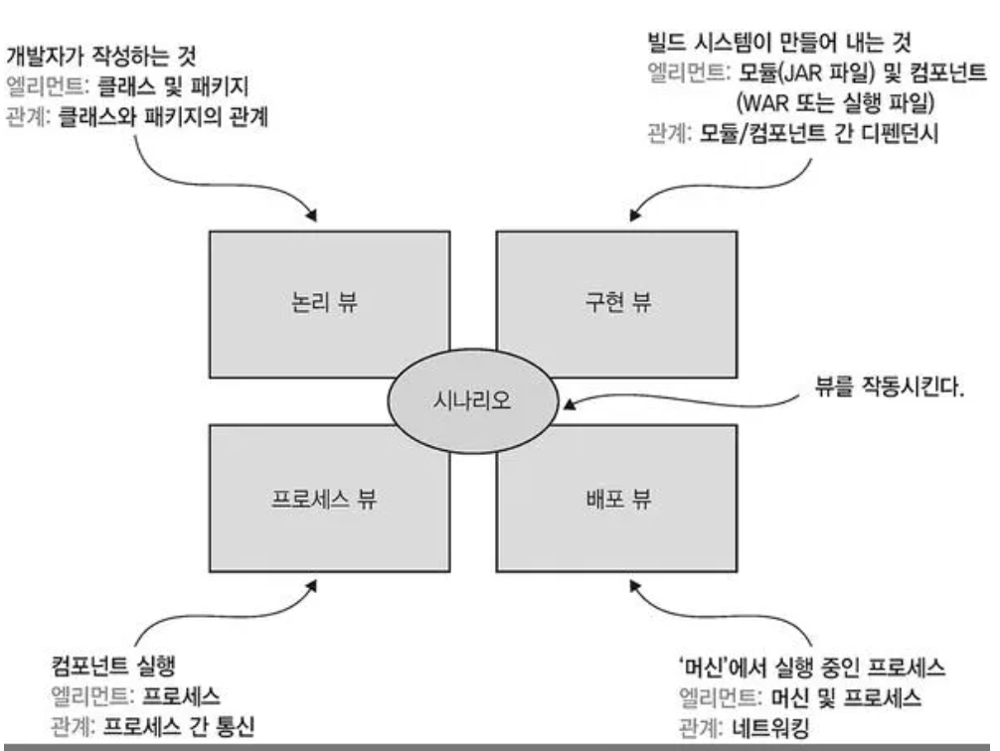 

### 아키텍처의 중요성
    - 기능 요건 : 애플리케이션이 해야 할 일을 정의, ex) 유스케이스, 유저 스토리 이용
    - 품질 요건 : 서비스 품질 요건, ex) 확장성, 신뢰성, 관리성, 테스트성, 배포성 등

 

### 2.1.2 아키텍처 스타일 개요
> 아키텍처 스타일은 체계적인 조직의 관점에서 시스템 군을 정의한다. 인스턴스에서 사용가능한 컴포넌트와 커넥터의 vocabulary, 이들을 조합할 수 있는 제약조건을 결정한다.

모놀리식 아키텍처도 구현 뷰를 하나의 실행/베포 가능한 컴포넌트로 구성한 아키텍처 스타일이라고 할 수 있다. 또한, 마이크로서비스 아키텍처는 느슨하게 결합된 여러 서비스로 구성하는 아키텍처 스타일이다.

### 계층화 아키텍처 스타일(Layered Architecture)
    - 소프트웨어 엘리먼트를 계층별로 구성하는 아키텍처 스타일이다.
    - 계층마다 명확히 정의된 역할을 분담
    - ex) 3계층 아키텍처
        - 표현 계층 : 사용자 인터페이스 또는 외부 API가 구현된 계층
        - 비지니스 로직 계층 : 비지니스 로직이 구현된 계층
        - 영속화 계층 : DB 상호 작용 로직이 구현된 계층

 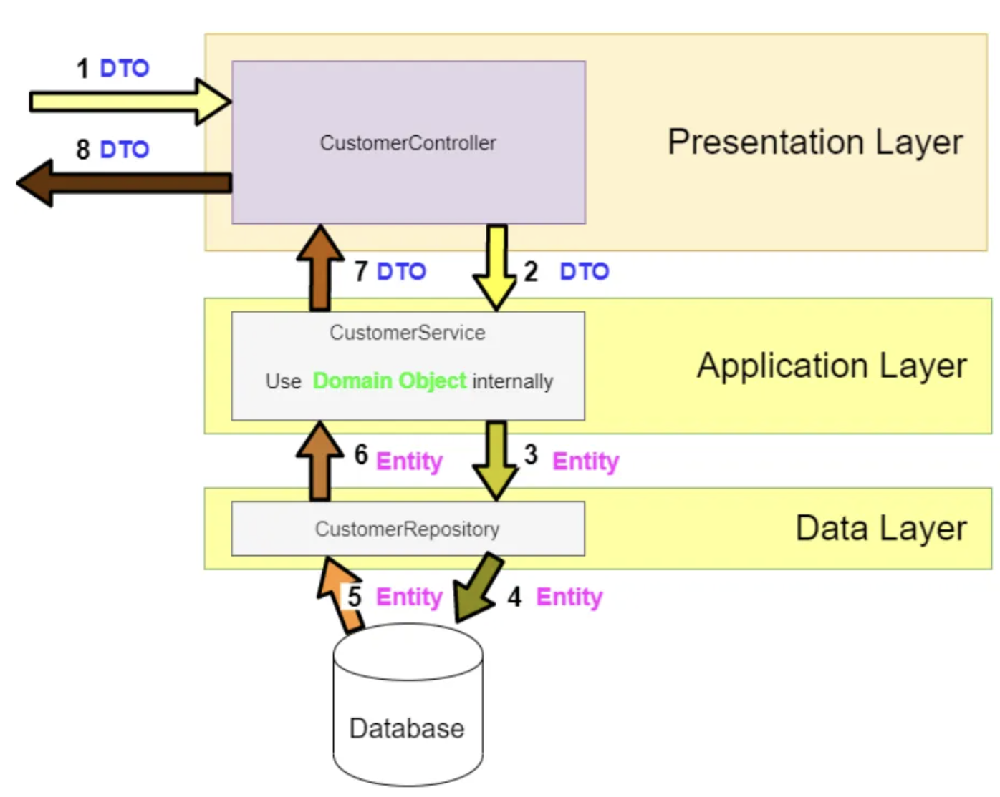 

### 육각형 아키텍처 스타일
    - 계층화 아키텍처의 대안
    - 어댑터를 이용하여 비지니스 로직이 어댑터에 전혀 의존하지 않게 구현
      - 인바운드 어댑터 : 비지니스 로직을 호출하여 외부에서 들어오는 요청을 처리
      - 아웃바운드 어댑터 : 비지니스 로직에 의해 호출되어 외부 애플리케이션을 호출

    - 비지니스 로직에는 하나 이상의 포트가 존재한다.
      - 포트 : 외부와 상호작용하는 방법이 정의된 방법
      - 인바운드 포트 : 비지니스 로직이 표출된 API ex) public 매서드
      - 아웃바운드 포트 : 외부 시스템을 호출하는 방법 ex) repository 인터페이스

    - 비지니스 로직이 표현/데이터 접근 로직 어디에도 의존하지 않음
    - 비지니스 로직만 따로 테스트 용의함

 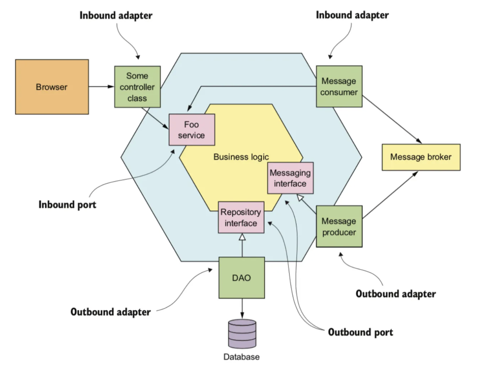 

 

### 2.1.3 마이크로서비스 아키텍처는 일종의 아키텍처 스타일이다
> 모놀리식 아키텍처는 구현 뷰를 단일 컴포넌트로 구성한 아키텍처 스타일이고, 마이크로서비스 아키텍처는 구현 뷰를 다수의 컴포넌트로 구성한다.

    - MSA는 다수의 컴포넌트로 구성되기 때문에 각 서비스별 자체 논리 뷰 아키텍처를 갖고 있다.
    - MSA의 핵심 제약 조건은 서비스를 느슨하게 결합한다는 것이다.
    - 서비스를 협동하는 방식에도 제약조건이 있다.

 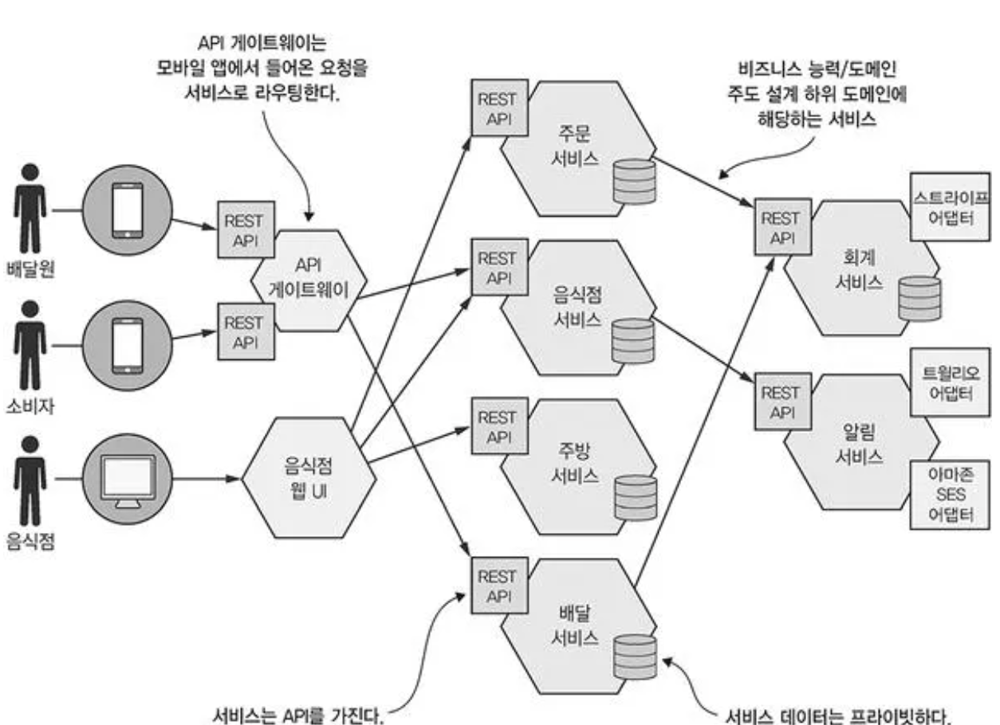 

### 서비스란 무엇인가?
    - 서비스는 기능이 구현되어 단독 배포가 가능한 소프트웨어 컴포넌트
    - 커맨드, 쿼리, 이벤트로 구성된 API 제공
    - API 내부 구현 상세를 캡슐화 -> API를 우회하여 서비스에 접근하는 코드 작성 불가(모듈성보장)
    - 자체 아키텍처를 갖고 있기 때문에 기술 스택에 자유로움

### 느슨한 결합
    - 서비스는 API를 통해서만 상호 작용하므로 클라이언트에 영향을 끼치지 않음
    - 유지보수성, 테스트성을 높이고 개발기간 단축
    - 서비스를 이해하고, 변경하기 쉬움
    - 서비스가 직접 DB와 통신하는 일이 불가능
    - DB를 공유하지 않기 때문에 여러 서비스에 걸쳐 데이터를 쿼리하고 일관성을 유지하는 일은 더  복잡함.

### 공유 라이브러리 역할
    - 코드 중복을 방지하기 위해 재사용 가능한 기능을 모듈화 해서 사용
    - 서비스 간 결합도를 유발하지 않도록 조심해야 함

### 서비스 규모는 별로 중요하지 않다
    - 서비스의 크기가 중요하지 않다.
    - 작은 팀이 가장 짧은 시간에, 다른 팀과 협동하는 부분을 최소로 하여 개발 가능한 서비스를 설계 해야함

  

## 2.2. 마이크로서비스 아키텍처의 정의
> 애플리케이션 아키텍처를 정의하는 3단계 프로세스 설명
    
    1단계 : 애플리케이션 요건을 핵심 요청으로 추출
        - 특정 기술이 아닌 추상적인 개념으로 접근한다.
        - 데이터를 업데이트하는 커맨드, 데이터를 조회하는 쿼리가 해당됨.
        

    2단계 : 여러 서비스로 분해하는 방법(전략) 결정
        - 비지니스 능력에 따라 정의, DDD의 하위 도메인별로 서비스를 구성하는 등 다양한 전략이 가능하다.
        - 최종 결과는 기술 개념이 아닌 비지니스 개념 중심으로 이루어진 서비스들이다.

    3단계 : 서비스별로 API를 정의
        - 1단계에서 식별된 시스템을 각 서비스에 배정

 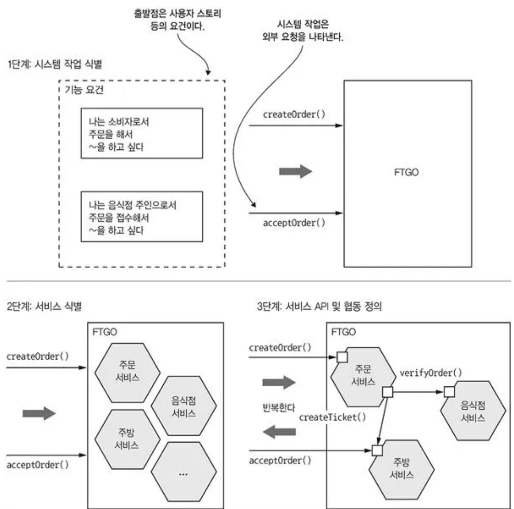 

 

### 2.2.1 시스템 작업 식별
    - 사용자 스토리와 사용자 시나리오등의 애플리케이션 요건 정의
    - 1단계는 핵심 클래스로 구성된 고수준의 도메인 모델을 생성
    - 2단계는 시스템 작업 식별 후 그 동작을 도메인 모델 관점에서 기술하는 것

 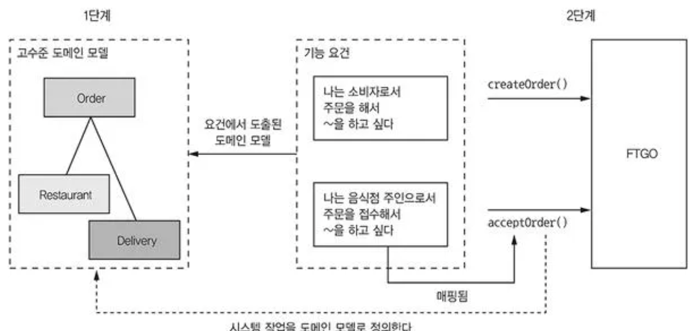 

### 고수준 도메인 모델 생성
    - 스토리나 시나리오에 포함된 명사를 분석
    - 도메인 전문가와 상담하는 등 표준 기법 활용

 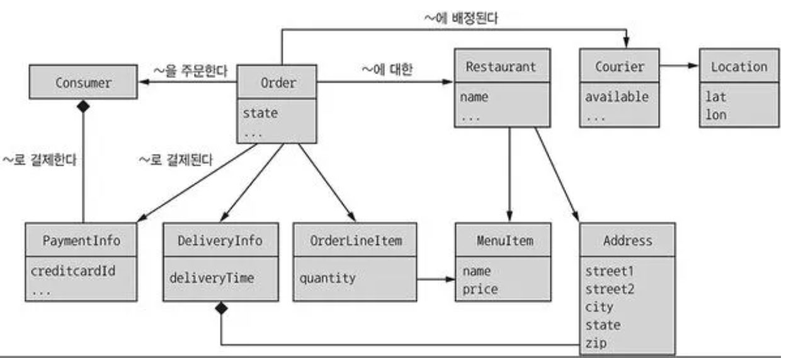 

### 시스템 작업 정의
    - 커맨드 : 데이터 생성, 수정, 삭제(CUD)
    - 쿼리 : 데이터 읽기(R)
    - 스토리나 시나리오에 포함된 동사를 분석

 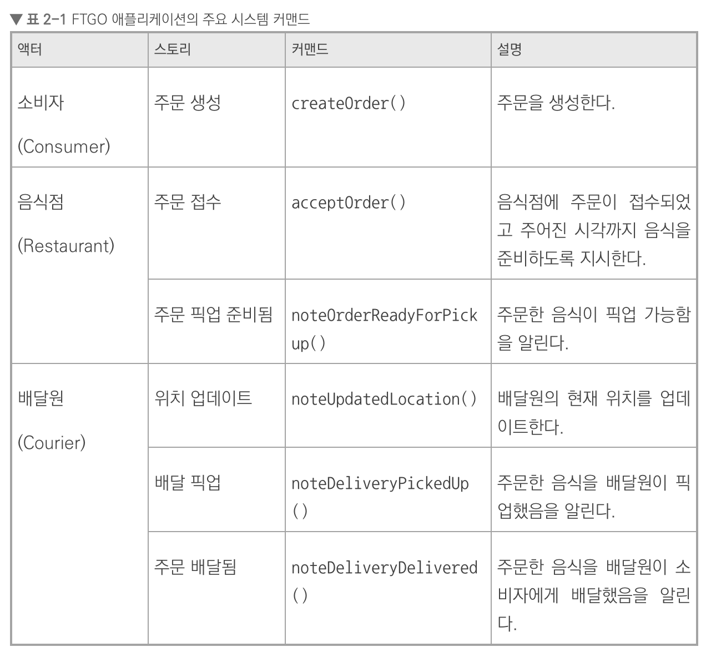 

 

### 2.2.2 서비스 정의 : 비즈니스 능력 패턴별 분해
    비즈니스 능력에 따른 분해
      - 비즈니스 능력 == 조직이 하는 일
      - 1. 조직의 목표, 구조, 프로세스를 분석하여 식별
      - 2. 비즈니스 능력에 따라 서비스를 정의함 (주관적일 수 있음)

    거의 변하지 않는 비즈니스 능력에 따라 서비스를 구성하면 비교적 안정적인 아키텍처를 구축할 수 있다.

 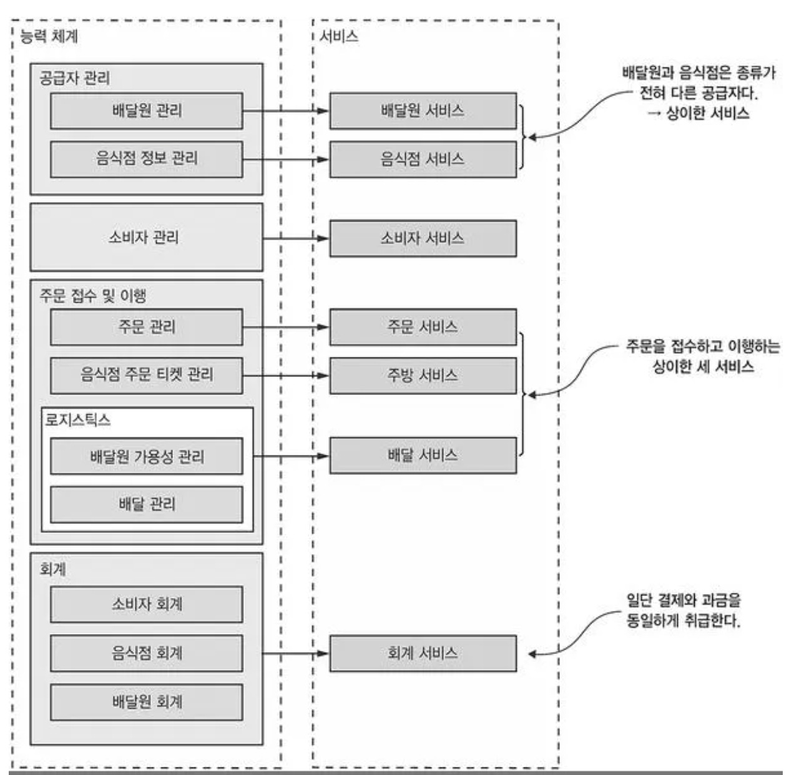 

 

### 2.2.3 서비스 정의 : 하위 도메인 패턴별 분해
    도메인 내부에서 문제 해결이 가능한 형태로 모델링 함(DDD)
    
    DDD의 하위 도메인, 경계 컨텍스트개념은 마이크로서비스 아키텍처와 잘 맞고, 서비스 자율팀 개념은 도메인 모델을 개별 팀이 소유/개발한다는 DDD사고방식과 어울린다.

 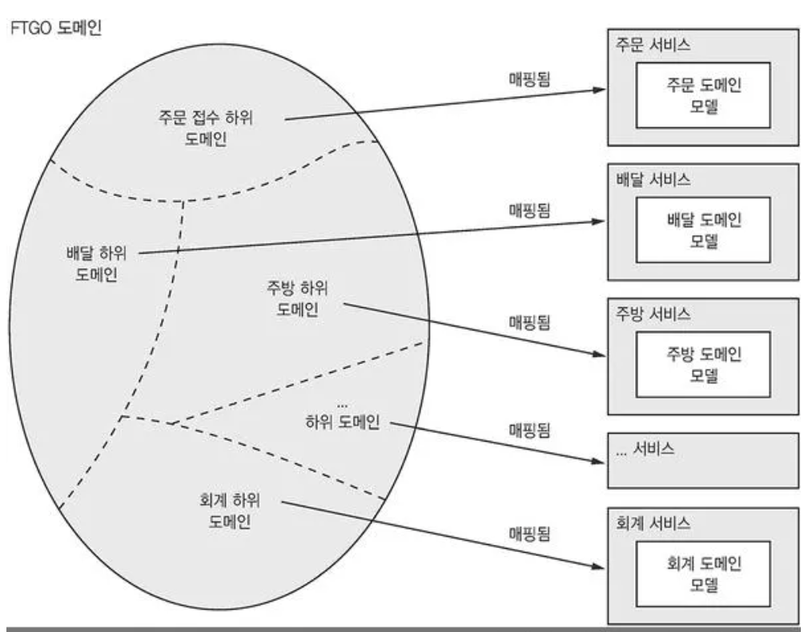 

 

### 2.2.4 분해 지침
    단일 책임 원칙 : 클래스는 오직 하나의 변경 사유를 가져야 한다.
      - 하나의 책임만 가진 작고 응집된 서비스를 정의할 수 있다.

    공동 폐쇄 원칙 : 패키지 클래스들은 동일한 유형의 변경에 대해 닫혀 있어야 한다.
      - 동일한 사유로 변경되는 컴포넌트를 모두 같은 서비스로 묶을 수 있다.
 

### 서비스 분해의 장애물
    네트워크 지연
      - 한 차례 왕복으로 여러 객체를 한 번에 가져오는 배치 API 구현
      - 언어 수준의 메서드나 함수 호출로 대체

    동기 통신으로 인한 가용성 저하
      - 비동기 메시징으로 강한 결합도를 제거하고 가용성을 높이는 방법이 있음.

    여러 서비스에 걸쳐 데이터 일관성 유지
      - 사가(saga)라는 전혀 다른 방식으로 트랜잭션을 관리해서 해결

    데이터의 일관된 뷰 확보
      - 실제로 거의 문제가 되지 않는다.

    분해를 저해햐는 만능 클래스
      - DDD를 적용하여 각 서비스를 자체 도메인 모델을 갖고 있는 개별 하위 도메인으로 취급

 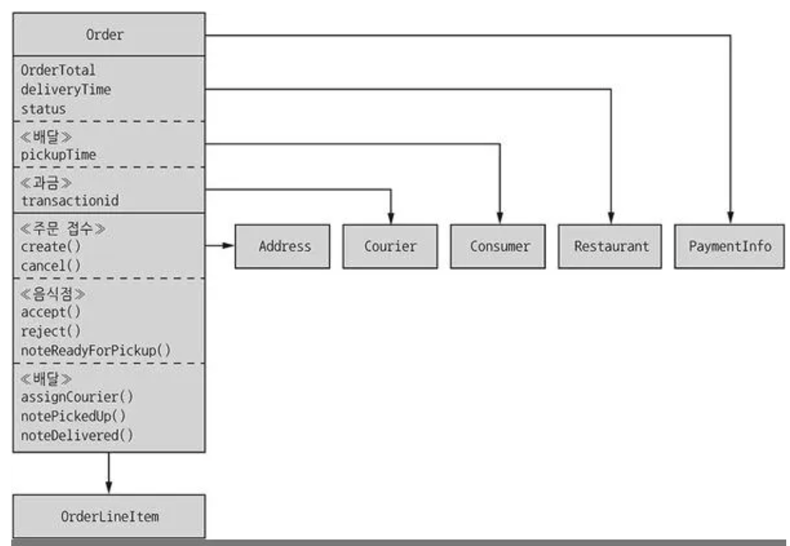 

 

### 2.2.6 서비스 API 정의
    1. 외부 클라이언트, 타 서비스가 호출하는 시스템 작업
    2. 서비스간 협동을 지원하기 위해 타 서비스 호출 전용으로 만든 작업
      - 서비스 이벤트는 주로 타 서비스와 협동을 위해 발행함
      - 이벤트를 활용해 사가(saga)를 구현하고 서비스 간 데이터 일관성 유지

### 시스템 작업을 서비스로 배정
    어떤 서비스가 요청의 진입점인지 판별해야 한다.

 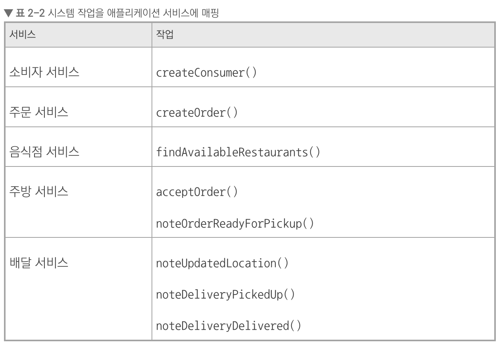 

### 서비스 간 협동 지원에 필요한 API 확정
    여러 서비스에 걸쳐 처리되는 시스템 작업을 위해 서비스간 협동이 필요

 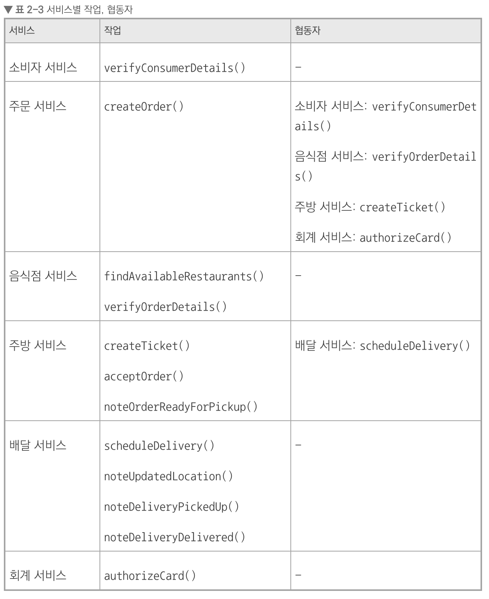 

      
  

## 2.3. 마치며
	- 아키텍처는 애플리케이션 개발 속도에 직접 영향을 주는 갖가지 '~성'을 좌우한다.
    - MSA는 애플리케이션의 관리성, 테스성, 배포성을 높이는 아키텍처 스타일이다.
    - 마이크로서비스는 기술적 관심사보다 비즈니스 능력, 하위 도메인 등 비즈니스 관심사 위주로 구성
    - DDD를 적용하고 서비스마다 도메인 모델을 따로 설계하면, 만능 클래스를 제거할 수 있다.