# 마이크로서비스 패턴

## Chapter 5. 비즈니스 로직 설계
> - 비즈니스 로직 패턴 적용: 트랜잭션 스크립트 패턴, 도메인 모델 패턴
> - DDD 애그리거트 패턴을 응용한 비즈니스 로직 설계
> - 도메인 이벤트 패턴을 마이크로서비스 아키텍처에 적용

### 개요
- 5.1 비즈니스 로직 구성 패턴
- 5.2 도메인 모델 설계: DDD 애그리거트 패턴
- 5.3 도메인 이벤트 발행
- 5.4 주방 서비스 비즈니스 로직
- 5.5 주문 서비스 비즈니스 로직
- 5.6 마치며


### 시작
비즈니스 로직이 여러 서비스에 흩어져 있는 마이크로서비스 아키텍처는 아래 이유로 인해 복잡한 비즈니스 로직을 개발하기가 까다롭다.
- 도메인 모델은 대부분 상호 연관된 클래스가 거미줄처럼 뒤얽혀 있다.
- 마이크로서비스 아키텍처 특유의 트랜잭션 관리 제약 조건하에서도 작동되는 비즈니스 로직을 설계해야 한다.

이러한 이슈는 DDD 애그리거트 패턴으로 해결할 수 있다.
- 애그리거트를 사용하면 객체 레퍼런스가 서비스 경계를 넘나들일이 없다. 객체 참조 대신 기본키를 이용하여 애그리거트가 서로 참조하기 때문이다.
- 한 트랜잭션으로 하나의 애그리거트만 생성/수정할 수 있다. 따라서 애그리거트는 마이크로서비스 트랜잭션의 모델의 제약 조건에 잘 맞다.


### 5.1 비즈니스 로직 구성 패턴

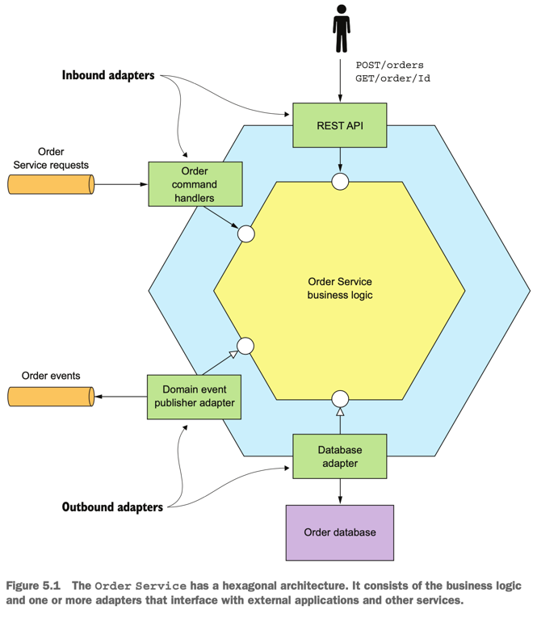

주문 서비스는 중심에 비즈니스 로직이 있고, 인바운드/아웃바운드 어탭터가 주변을 감싼 육각 아키텍처 구조이다.
- 인바운드 어댑터 : 클라이언트 요청을 받아 비즈니스 로직을 호출
- 아웃바운드 어댑터 : 비즈니스 로직의 요청을 받아 다른 서비스 및 어플리케이션을 실행

비즈니스 로직은 절차적 트랜잭션 스크립트 패턴과 객체 지향적 도메인 모델 패턴, 두 가지 패턴을 적절히 선택하여 구성한다.

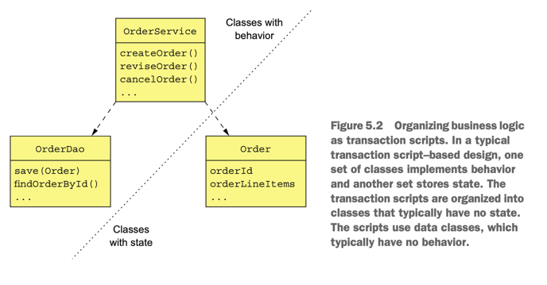
1. 트랜잭션 스크립트 패턴
- 객체지향 설계를 하지 않고 트랜잭션 스크립트라는 메서드를 작성하여 표현 계층에서 들어온 요청을 처리하는 방식이다.
- 절차적 설계가 더 적합한 단순한 비즈니스 로직에는 적용해도 무방하다.
- 도메인 계층은 상태만 갖고 있고, Service 계층에서 모든 동작을 처리하는 방식이다.
  - 빈약한 도메인 패턴이라고도 부른다.
- 비즈니스 로직을 요청 타입별로 하나씩 매핑된 절차적 트랜잭션 스크립트 뭉치로 구성한다.


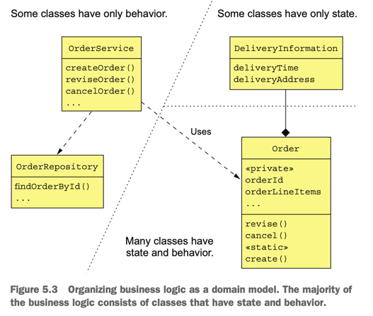
2. 도메인 모델 패턴
- 절차적 방식은 단순하게 코딩할 수 있지만, 비즈니스 로직이 복잡해지면 유지보수성이 매우 악화되기 때문에 도메인 모델 패턴을 응용한 객체 지향 설계를 하는 것이 좋다.
- 도메인 계층이 상태와 행위(동작)을 모두 관리하는 방식이다. 즉, 도메인 객체에 비즈니스 로직을 작성하는 방식이다.
  - 객체의 상태값은 해당 객체를 통해서만 변경 가능한 방식 (OOP 관점에서 더 올바른 방식)
- 서비스 계층은 도메인 계층에게 역할을 위임하기만 한다.
- 장점
  - 코드 설계를 이해/관리하기 좋음
  - 테스트하기 쉬움
  - 여러 설계 패턴을 응용해서 확장하기 쉬움


### 5.2 도메인 모델 설계: DDD 애그리거트 패턴

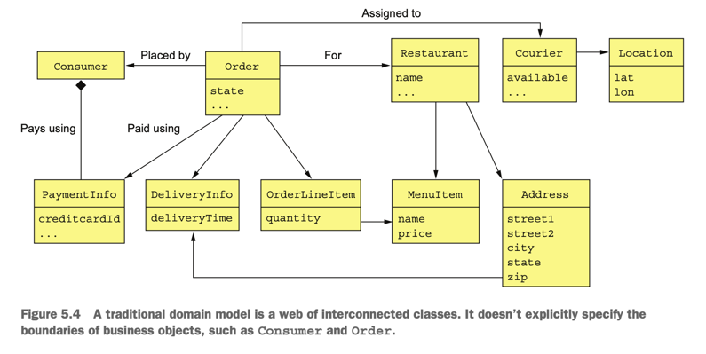

전통적인 도메인 모델은 비즈니스 객체들의 경계가 불분명하다. 경계가 불분명하면 마이크로서비스 아키텍처에서 문제가 생길 가능성이 높다.
예를들어, 아래와 같이 다양한 비즈니스 객체가 있는데 어떤 클래스가 Order라는 비즈니스 객체 일부인지 분명하지가 않다.


1. 불분명한 경계 문제
- 도메인 간 경계가 불분명하면 마이크로서비스 아키텍처에서 문제가 생길 가능성이 높다.(주문 상태 동시성 이슈 등)
- DDD 애그리거트는 이런 문제를 해결하기에 적합하다.

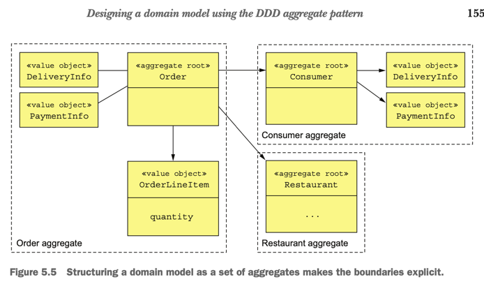
2. 애거리거트는 경계가 분명
- 애그리거트는 한 단위로 취급 가능한 경계 내부의 도메인 객체들이다.
- 하나의 루트 엔터티와 하나 이상의 기타 엔터티 + 밸류 객체로 구성된다.
- 애그리거트는 일관된 경계
  - 작업은 애그리거트 단위로 이루어지며, 애그리거트 루트를 통해 전체 엔티티들이 역할을 수행하게 된다.
  - 동시성 문제는 버저닝 또는 DB 락으로 처리한다.
- 애그리거트를 식별하는 일이 관건
  - DDD 도메인 모델 설계의 핵심은 애그리거트와 그 경계, 그리고 애그리거트 루트를 식별하는 것이다.

3. 애그리거트 규칙
- #1 애그리거트 루트만 참조하라
 - 외부 클래스는 각 애그리거트 루트를 통해서만 참조를 할 수 있게 해야한다. 무분별한 값 변경을 방지하기 위해서다.
- #2 애그리거트 간 참조는 반드시 기본키를 사용하라
  - 애그리거트는 객체 레퍼런스 대신에 기본키를 가지고 서로 참조를 해야 한다. (분리/메모리 관점에서도 유리)
  - 애그리거트간의 경계는 분명하되, 느슨하게 결합되어야 하기 때문에 기본키와 FK를 통해 연결하는것이 좋다.
- #3 하나의 트랜잭션으로 하나의 애그리거트를 생성/수정하라
  - 하나의 트랜잭션으로 하나의 애그리거트를 생성/수정해야 한다.
  - 데이터의 정합성을 맞추기 위해 하나의 트랜잭션으로 프로세스가 이루어 져야 하고, 이 프로세스는 앞장에서 배운 사가를 사용해 관리해야 일관성을 유지할 수 있다.

  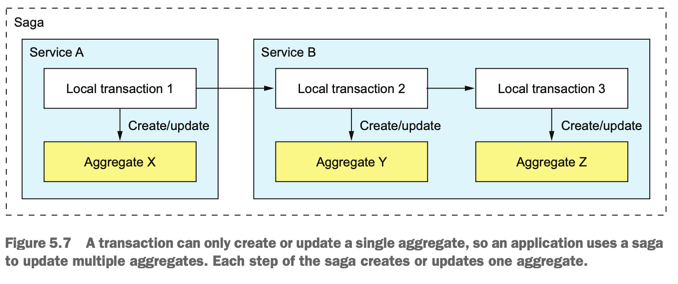

4. 애그리거트 분리
- 애그리거트의 단위는 작을수록 좋다. 잘게 나누어져있는만큼 동시 처리 가능한 요청 개수가 늘고 확장성이 좋아진다.
- 애그리거트 자체가 곧 트랜잭션의 범위라서 어떤 업데이트를 원자적으로 처리하려면 애그리거트를 크게 잡아야 할 수도 있으나, 가능하면 잘게 나누는 것이 최선이다.

5. 비즈니스 로직 설계 : 애그리거트

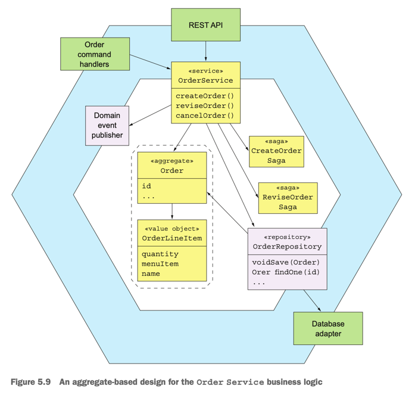

- 서비스 비즈니스 로직은 대부분 애그리거트로 구성된다.
- 사가 : 로컬 트랜잭션을 오케스트레이션하여 데이터의 일관성을 맞춘다.
- 인바운드 어댑터 : 비즈니스 로직의 진입점인 서비스를 호출한다.
- 주문 서비스에 국한된 간단한 요청은 Order 애거리거트를 직접 업데이트하고, 여러 서비스에 걸친 업데이트 요청은 사가를 생성하여 처리한다.


### 5.3 도메인 이벤트 발행

DDD의 입장에서 도메인 이벤트는 애그리거트에 발생한 이벤트이다.
애그리거트는 상태가 전이될 때마다 이에 관련된 컨슈머를 위해 이벤트를 발행한다.(애그리거트는 뭔가 생성되거나 상태가 변경이 발생했을 때 도메인 이벤트를 발행한다.)

1. 변경 이벤트를 발행하는 이유
- 도메인 상태 변경을 다른 서비스 또는 애플리케이션 내 다른 컴포넌트에 알리기 위해 사용한다.
  - 예시 - 주문 생성 완료 등

2. 도메인 이벤트란 무엇인가
- 과거 분사형 동사로 명명한 클래스이다. 이벤트에 의미를 부여하는 프로퍼티는 원시값 또는 밸류 객체이다.
- 감사 등의 용도를 위해 변경을 일으킨 사용자의 신원 정보와 같은 메타데이터를 넣기도 한다.
  - 메타데이터 : 이벤트 ID, 타임스탬프, 신원정보 등
  - 메타데이터는 상위 클래스에 정의된 이벤트 객체의 일부이거나, 이벤트 객체를 감싼 엔벨로프 객체에 있다.

  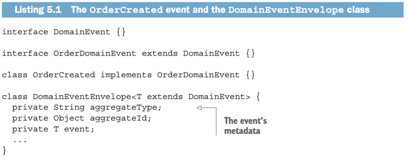

3. 이벤트 강화(event enrichment)
- 발생 된 이벤트를 컨슈머가 받아서 처리할 때, 컨슈머가 서비스를 쿼리해서 애그리거트를 조회하는 것은 오버헤드를 유발한다.
- 그러므로, 컨슈머에 필요한 정보를 이벤트가 갖고 다니는 이벤트 강화 기법을 적용한다.
- 장점 : 컨슈머 로직을 단순화한다.
- 단점 : 컨슈머 요건이 바뀌면 이벤트 클래스도 함께 바꾸어야 하므로 이벤트 클래스의 안정성은 떨어진다.(유지보수성)
```java
class OrderCreatedEvent implements OrderEvent {
  private List<OrderLineItem> lineItems;
  private DeliveryInformation deliveryInformation; // event enrichment
}
```

4. 도메인 이벤트 식별
- 복잡한 도메인을 이해하기 위해, 이벤트 스토밍(event storming) 방식의 워크숍을 많이 사용하는 추세이다. 
- 이벤트 스토밍은 도메인 모델을 신속하게 구축할 수 있는 기법이다.
  - 이벤트 브레인스토밍 : 도메인 이벤트 작성
  - 이벤트 트리거 식별 : 각각의 이벤트를 일으키는 트리거를 식별
  - 애그리거트 식별 : 각 커맨드 소비 후 적절한 이벤트를 발생시키는 애그리거트를 식별
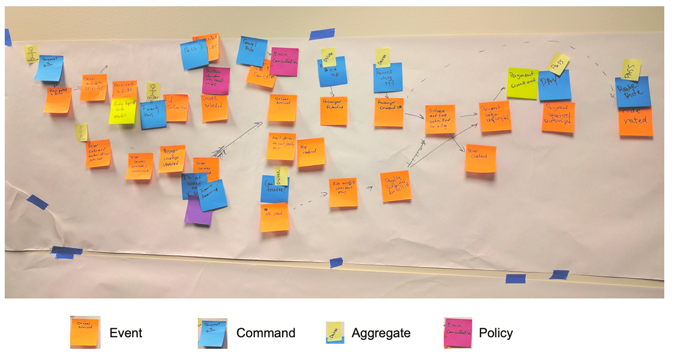

5. 도메인 이벤트 생성 및 발행
- 개념적으로 도메인 이벤트는 애그리거트가 발행한다.
- 애그리거트는 자신의 상태가 변경되는 시점과 그 결과 어떤 이벤트를 발행할 지 알고 있다.
- 인프라 관심사와 비즈니스 로직이 섞이지 않도록 애거리거트와 호출하는 서비스의 책임을 분리하는 것이 좋다.
- 도메인 이벤트를 확실하게 발행하는 방법
  - 메세지를 로컬 DB 트랜잭션의 일부로 확실하게 전달하는 방법과 동일하다.(3장 p.140 트랜잭셔널 아웃박스 패턴)
  - 서비스는 DB에서 애그리거트를 업데이트하는 트랜잭션의 일부로 이벤트를 발행하기 위해 트랜잭셔널 메시징을 사용해야 한다.
  - DB 업데이트 트랜잭션의 일부로 이벤트를 아웃박스 테이블에 삽입하고, 트랜잭션이 커밋되면 이 테이블에 삽입된 이벤트를 메세지 브러커에 발행한다.

6. 도메인 이벤트 소비
- 도메인 이벤트는 결국 메세지로 바뀌어 아파치 카프카 같은 메세지 브로커에 발행된다.


### 5.4 주방 서비스 비즈니스 로직

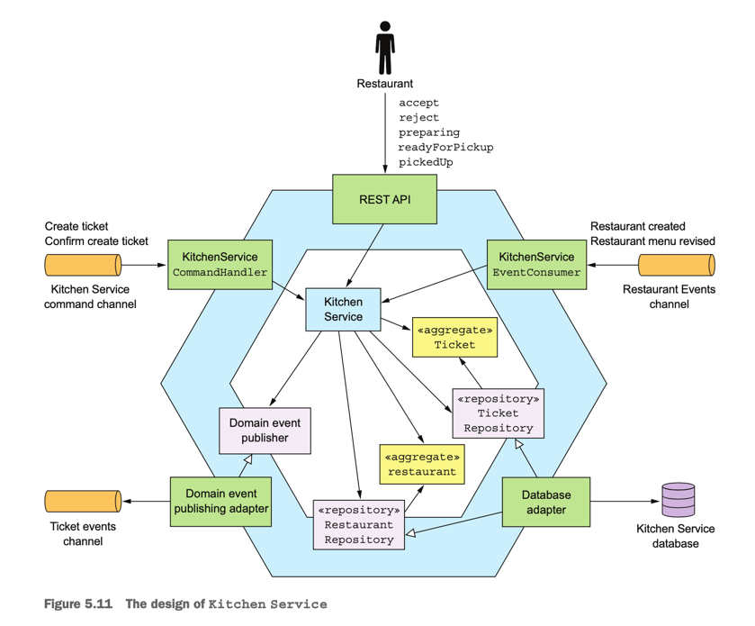
- 내용 생략


### 5.5 주문 서비스 비즈니스 로직

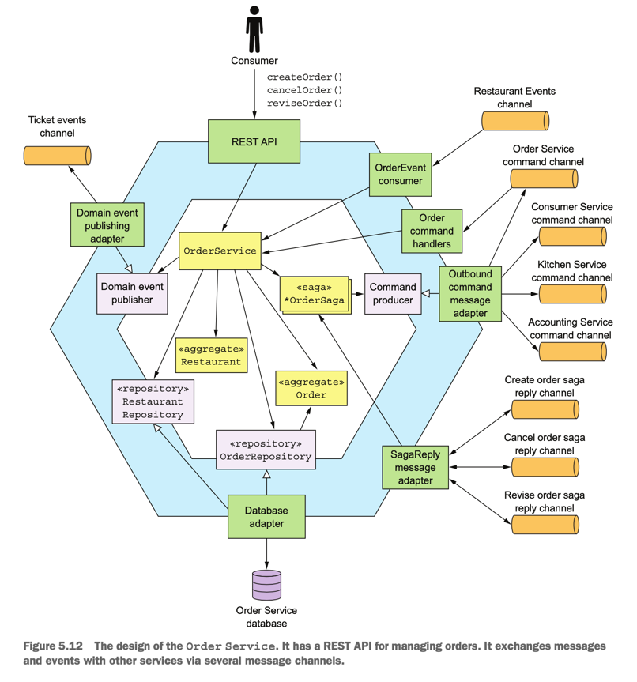
- 주문 서비스 비즈니스 로직 예제이다.

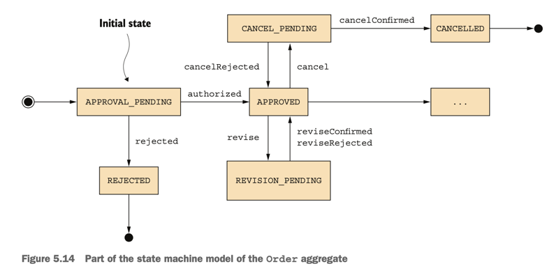
- Order 애그리거트의 상태 기계 모델이다.
- 주문을 생성/수정하려면 OrderService는 반드시 다른 서비스와 사가로 협동해야 한다.
- Order는 상태머신과 같이 상태를 갖으며, 사가 작업이 문제 없다면 상태를 전이시키고 그렇지 않다면 롤백한다.


### 5.6 마치며
- 비즈니스 로직이 단순하다면 절차적 트랜잭션 스크립트 패턴도 괜찮은 방법이지만, 복잡한 비즈니스 로직은 객체 지향적 도메인 모델 패턴에 따라 구현하는 것이 좋다.
- 서비스의 비즈니스 로직은 DDD 애그리거트들로 구성하는 것이 좋다. DDD 애그리거트는 도메인 모델을 모듈화하고,서비스 간 객체 참조 가능성을 배제하며, 전체 ACID 트랜잭션을 서비스 내부에 국한시키므로 유용하다.
- 애그리거트는 도메인 이벤트 생성/수정 시 이벤트를 발행한다. 도메인 이벤트는 활용 범위가 다양하다.


<br>

## Reference
- Chris Richardson - Microservices Patterns
