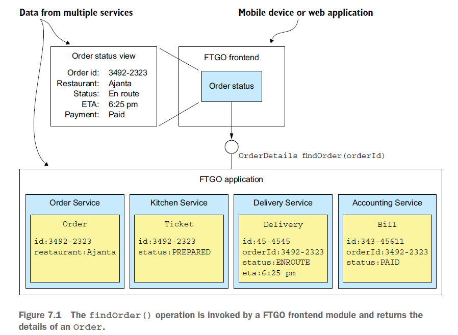
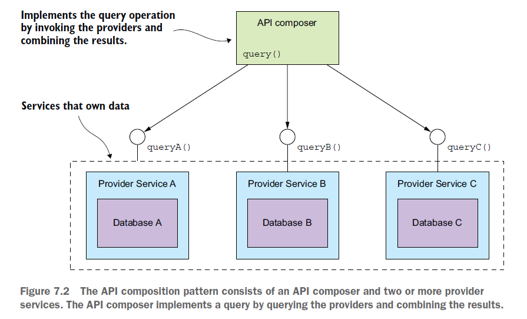
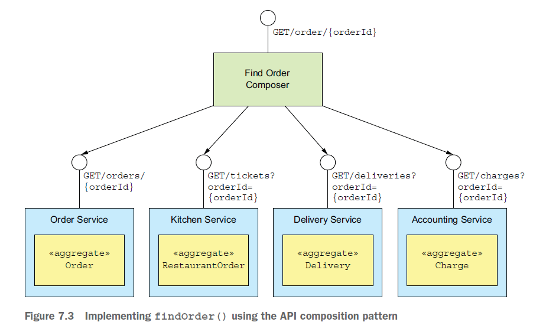
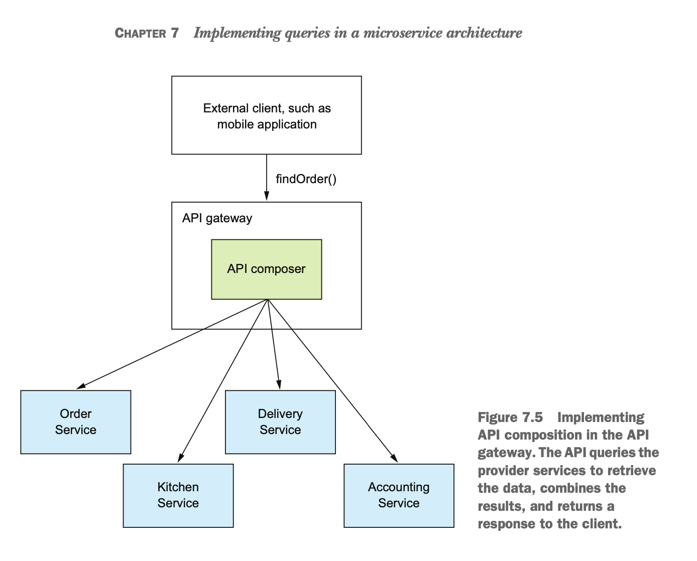
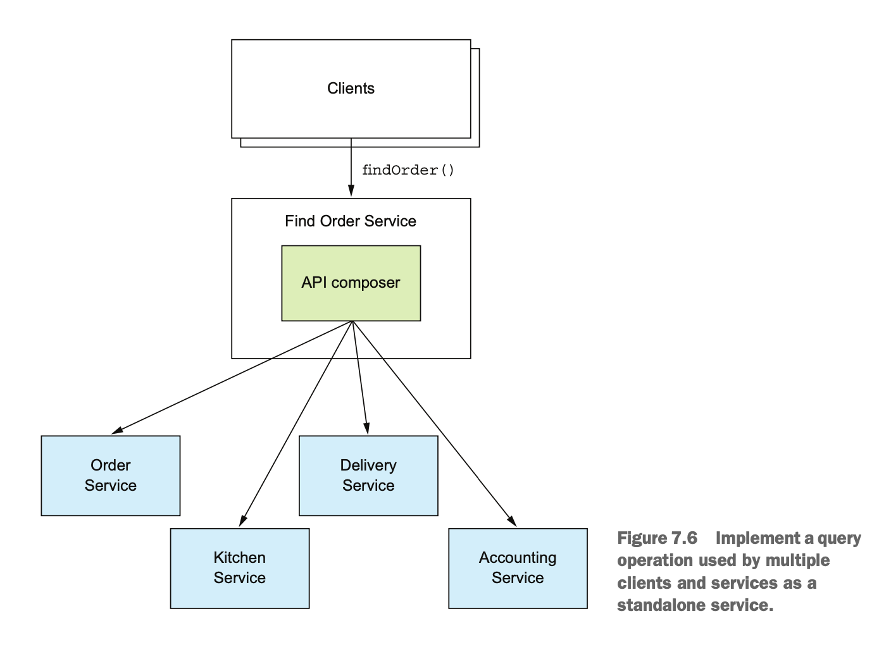
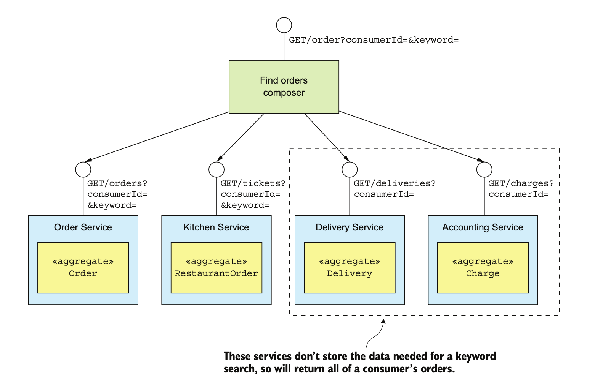
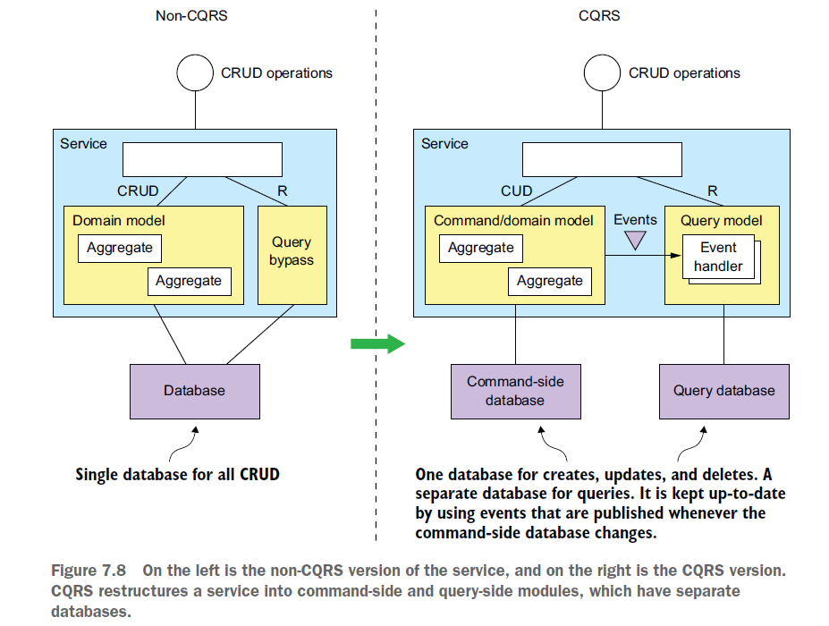

# 마이크로서비스 패턴

## Chapter 7. 마이크로서비스 쿼리 구현

> - 마이크로서비스 아키텍처에서 데이터를 쿼리하기 어려운 이유
> - API 조합 패턴을 응용한 쿼리 구현
> - CQRS 패턴을 응용한 쿼리 구현

### 개요

- 7.1 API 조합 패턴 응용 쿼리
- 7.2 CQRS 패턴
- 7.3 CQRS 뷰 설계
- 7.4 CQRS 뷰 구현: AWS DynamoDB 응용
- 7.5 마치며

 
 

### 7.1 API 조합 패턴 응용 쿼리

API 조회 패턴을 이용하여 findOrder() 를 구현하는 방법

### findOrder() 쿼리

> 기본키로 주문 정보를 조회하는 매서드, orderId를 매개변수로 받아 주문 내역이 포함된 OrderDetails 객체를 반환

- 모놀리식 애플리 케이션은 전체 데이터가 하나의 DB에 있기 떄문에 쉽게 조회 가능
- MSA는 데이터가 여러 서비스에 뿔뿔이 흩어져서 조회하기 어려움

 

### API 조합 패턴의 개요

> API 조합 패턴은 데이터를 가진 여러 프로바이더 서비스에 API 로 호출후 결과값을 가져와 조합한다.

- API 조합기 : 프로바이더(제공자) 서비스를 쿼리하여 데이터 조회
- 프로바이더 서비스 : 최종 결과로 반환할 데이터의 일부를 갖고 있는 서비스

이 패턴으로 특정 쿼리 작업을 구현할 수 있는지는 데이터의 상태, 프로바이더가 제공하는 API 기능, DB 등에 따라 다르다. 대부분의 경우
이 패턴을 적용해서 쿼리 작업을 구현할 수 있다.

 

### API 조합 패턴으로 findOrder() 구현

> findOrder()는 단순히 orderId를 사용하여 필요한 데이터들을 가져올 수 있음.

- 각 프로바이더 서비스는 애그리거트 하나에 해당하는 응답을 반환하는 API 제공
- 주문서비스는 기본키로 조회하고 다른 서비스들은 외래키로 애그리거트를 조회한다.
- orderId로 네 서비스를 호출한 후 수신으로 응답을 조인한다.

 

### API 조합 설계 이슈

API 조합 패턴의 두 가지 설계 이슈

- 어느 컴포넌트를 쿼리 작업의 API로 선정할 것인가?
- 어떻게 해야 효율적으로 취합 로직을 작성할 것인가?

 

#### 누가 API 조합 역할을 맡을 것인가 ?

1. 서비스 클라이언트를 API 조합기로 임명

- 클라이언트가 방화벽 외부에 있고 서비스가 위치한 네트워크가 느리다면 효율적이지 않음.

2. 애플리케이션의 외부 API가 구현된 API 게이트웨이를 API 조합기로 선택

- 클라이언트에서 API 게이트웨이 호출 -> API 게이트웨이에서 다른 서비스들 호출하여 조합 로직 구현

3. API 조합기를 스탠다드얼론 서비스로 구현

- 취합 로직이 너무 복잡하거나 외부에서 접근 가능한 쿼리 작업을 구현해야할 경우 사용

 

#### API 조합기는 리액티브 프로그래밍 모델을 사용해야 한다.

> 분산 시스템은 지연 시간을 최소화해야 함

- 의존 관계가 없는 경우 API 조합기가 프로바이더 서비스를 병렬로 호출
- 의존 관계가 있느 경우 일부 프로바이더 서비스를 순차 호출
- 자바의 CompletableFuture, RxJava의 observable 등 리액티브 설계 기법을 동원해야 함.

 

### API 조합 패턴의 장단점

오버헤드 증가

- 여러 서비스 및 DB 를 쿼리하기 때문에 네트워크 리소스 및 애플리케이션 운영 비용 증가

가용성이 저하될 우려가 있다.

- 하나의 쿼리 작업에 여러 서비스가 반드시 개입되는 구조임.
- 가용성을 높이는 전략
  - 첫째, 프로바이더 서비스가 불능일 경우 캐시를 도입하여 데이터 반환
  - 둘째, API 조합기가 미완성된 데이터를 반환 (불능인 서비스 데이터 이외의 데이터들만 반환)

데이터 일관성이 결여된다.

- 여러 DB를 대상으로 여러 쿼리를 실행하기 때문에 일관되지 않은 데이터가 반환될 수 있다.

 
 

### 7.2 CQRS 패턴

> 엔터프라이즈 애플리케이션은 대부분 RDBMS에서 레코드를 관리하고, 텍스트 검색은 Elasticsearch, slor 등의 텍스트 검색 DB 를 이용함.  
> CQRS는 이런 종류의 아키텍처를 일반화한 것, 하나 이상의 쿼리가 구현된 하나 이상의 뷰 DB를 유지하는 기법

 

### CQRS의 필요성

#### findOrderHistory() 구현

- consumerId : 소비자 식별자
- OrderHistoryFilter : 필터조건, 어느 시점 이후 주문까지 반환할 것인가(필수), 주문상태(옵션), 음식점명 및 메뉴 항목을 검색할 키워드(옵션)
- 다건 주문 목록을 반환

모든 서비스가 필터 / 정렬 용도의 속성을 보관하는 것이 아니기 때문에 간단하지 않다.  
주문, 주방서비스는 메뉴항목을 저장하고 있지만 다른 서비스들은 저장하고 있지 않기 때문에 keyword로 필터링 할 수 없다.

해결 방법은

- 첫째, 배달, 회계 서비스에서 소비자의 모든 주문정보를 가져온 후 데이터를 조인하는 방법
- 둘째, 주문, 주방 서비스에서 데이터 조회 후, id를 추출해 다른 서비스에 요청, 해당 서비스가 다건 조회 API를 제공해야함. 단건 조회만 가능할 경우 과도한 네트워크 트래픽 유발

 

#### 어려운 단일 서비스 쿼리

- 데이터를 가진 서비스에 쿼리를 구현하는 것이 부적절한 경우
- 서비스 DB 가 효율적인 쿼리를 지원하지 않는 경우
  - 지리 공간을 검색하는 기능을 구현해야할 경우 Mongo, MySQL, Postgres의 지리 공간 확장팩을 이용하면 아주 쉽게 구현할 수 있음.

 

#### 관심사를 분리할 필요성

- 데이터소유권만 보고 쿼리를 구현하지 말자, 한 서비스에 너무 많은 책임을 부과하게 될 수 있음.

 

### CQRS 개요

해당 이슈를 해결할 수 있는 묘안이 CQRS 패턴이다.

- API를 조합하여 여러 서비스에 흩어진 데이터를 조회하려면 값비싸고 비효율적인 인-메모리 조인을 해야한다.
- 데이터를 가진 서비스는 필요한 쿼리를 효율적으로 지원하지 않는 DB 또는 그런 형태로 데이터를 저장한다.
- 관심사를 분리할 필요가 있다는 것은 데이터를 가진 서비스가 쿼리 작업을 구현할 장소로 적합하지 않다는 뜻이다.

 

#### CQRS는 커맨드와 쿼리를 서로 분리한다.

- CQRS 패턴에서 조회(R)기능은 쿼리 모듈, 생성(C)/수정(U)/삭제(D)는 커맨드 모듈에 구현한다.
- 커맨드 모듈에서는 데이터가 바뀔 때마다 도메인 이벤트를 발행한다.
- 쿼리 모듈에서는 도멩니 이벤트를 구독하고 DB를 업데이트 한다.

 

#### 쿼리 전용 서비스

- 쿼리 서비스에는 커맨드 작업이 전혀 없는 쿼리 작업만으로 구성된 API만 구현
- 하나 이상의 다른 서비스가 발행한 이벤트를 구독하여 항상 최신 상태로 유지되는 DB를 로직 구현
- 쿼리 서비스는 특정 서비스에 종속되지 않도록 스탠드얼론(stand alone) 서비스로 개발

 

### CQRS의 장점

MSA에서 쿼리를 효율적으로 구현할 수 있다.

- API 조합패턴, CQRS 패턴을 사용하여 구현
- CQRS 패턴 사용하면 단일 데이터 저장소의 한계를 극복할 수 있다.

이벤트 소싱 애플리케이션에서 쿼리 가능

- 이벤트 저장소는 기본키 쿼리만 지원가능한 한계를 극복함.
- CQRS 패턴은 하나 이상의 애그리거트 뷰를 정의하고 이벤트 소싱기반의 이벤트스트림을 구독해 최신상태를 유지한다.

관심사가 더 분리된다.

- CQRS 패턴은 서비스의 커맨드 모듈, 쿼리 모듈에 각각 알맞은 DB 스키마를 별도로 정의해서 사용한다.

 

### CQRS의 단점

아키텍처가 복잡하다.

- 뷰를 조회/수정 하는 쿼리서비스를 작성하고, 별도의 저장소를 관리해야함.
- 개발 / 운영의 복잡도가 가중됨

복제 시차를 신경 써야 한다.

- 커맨드 <-> 쿼리 lag 을 처리해야 한다.
- 이벤트를 발행하고 이벤트를 받아 업데이트하는 시점 사이에 지연이 발생한다.
- 일관되지 않은 데이터가 최대한 노출되지 않도록 개발해야함.

 
 

### 7.3 CQRS 뷰 설계

CQRS 뷰 설계시 고려할 사항

- DB를 선정하고 스키마를 설계해야 한다.
- 데이터 접근 모듈을 설계할 떄, 멱등한/동시 업데이트 등 다양한 문제를 고려
- 뷰를 추가하거나 변경할 경우 효율적으로 빌드할 수 있는 수단을 강구
- 뷰 클라이언트에서 복제 시차(lag)을 어떻게 처리할지 결정

 

### 뷰 DB 선택

#### SQL vs NoSQL DB

- NoSQL DB는 유연한 데이터 모델, 우수한 성능 및 확장성 때문에 CQRS 뷰와 잘맞음.
- CQRS 뷰는 단순 트랜잭션만 사용하고 고정된 쿼리만 실행하기 때문에 NoSQL DB의 제약 사항에도 영향을 받지 않는다.

  

#### 업데이트 기반 작업지원

- 이벤트 핸들러가 실행할 업데이트 작업을 효율적으로 구현할 수 있어야 한다.

  

### 데이터 접근 모듈 설계

- 이벤트 핸들러와 쿼리 API 모듈이 직접 DB에 접근하지 않고, 데이터 접근 객체(DAO) 및 핼퍼 클래스를 통해 접근한다.

동시성 처리

- 여러 종류의 애그리거트가 발행한 이벤트를 구독할 경우 하나의 레코드를 업데이트하는 경우가 발생할 수 있다.
- 낙관적 잠금 or 비관적 잠금을 적용

 

### 멱등한 이벤트 핸들러

- 이벤트 핸들러는 같은이벤트를 한 번 이상 처리할 수 있기 떄문에 멱등성을 보장해야 한다.

 

### 클라이언트 애플리케이션이 최종 일관된 뷰를 사용할 수 있다.

- CQRS를 적용하면 커맨드 <-> 쿼리 의 동기화작업이 필요하기 때문에 업데이트 한 내용이 아닐 수 있다.  
- 커맨드와 쿼리 모듈 API를 이용하여 클라이언트가 비일관성을 감지하게 만들수 있다. (ID가 포함된 토큰 발급 방식)

 

### CQRS 뷰 추가 및 업데이트

#### 아카이빙된 이벤트를 이용하여 CQRS 뷰 구축

- 메시지 브로커는 메시지를 무기한 보관할 수 없다.
- AWS S3와 같은 아카이빙된, 오래된 이벤트도 가져올 수 있어야 한다.

 

#### CQRS 뷰를 단계적으로 구축

- 전체 이벤트를 처리하는 시간/리소스가 점차 증가하는 문제도 발생할 수 있다.
- 주기적으로 스냅샷을 생성하고 비교하여 뷰를 생성해야 한다.

 
 

### 7.5 마치며

- 여러 서비스의 데이터를 가져옹는 쿼리는 구현하기 쉽지 않다.
- 여러 서비스의 데이터를 조회하는 쿼리는 크게 API 조합 패턴과 CQRS 패턴으로 구현한다.
- 여러 서비스에서 데이터를 취합하는 API 조합 패턴은 쿼리를 구현하기 가장 간편한 방법이다.
- API 조합 패턴은 복잡한 경우 대량 데이터를 인-메모리 조인해야 하므로 효율이 낮다.
- CQRS 패턴은 뷰 전용 DB를 이용한다.
- CQRS 패턴은 중복 이벤트 처리, 동시성 이슈를 처리할 수 있어야 한다.
- CQRS 는 관심사 분리 관점에서 유리하다.
- 클라이언트는 CQRS 뷰의 최종 일관성을 처리해야 한다.

 

## Reference

- Chris Richardson - Microservices Patterns
