# ch09. 마이크로서비스 테스트 1부

- 수동 테스트는 비효율적이고 테스트가 늦어 비생산적입니다.
- 마이크로서비스 아키텍처를 도입하는 중요한 계기는 테스트성을 개선하는 것이며, 
- 개발자가 개발의 한 과정으로 자동화 테스트(automated test)를 작성하는 것이 생산적으로 일하는 방법입니다. 


## 9.1.마이크로서비스 아키텍처 테스트 전략 

- 개발 도중 실행가능한 자동화 테스트 작성한다.  

   


### 9.1.1. 테스트 개요
 - 테스트의 목적: SUT(System Under Test, 테스트 대상 시스템)의 동작을 확인하는 것
 - 여기서 시스템이란 테스트 해야할 소프트웨어를 가리킴 
 - 예를들어, 클래스 수준의 작은단위, 전체 애플리케이션 만큼 큰 단위, 여러 클래스, 개별 서비스 같이 중간 단위일 수 있음
 - 테스트 스위트는 서로 연관된 테스트를 모아놓은 것
 
 <center> 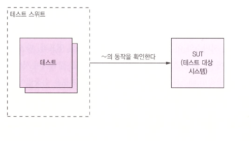</center>
 
 #### 자동화 테스트 작성 
 <center> 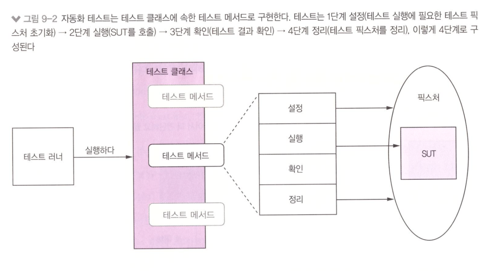</center>  
 
  - 자동화 테스트는 다음 4단계로 구성됨 
   1. 설정: SUT와 그 디펜던시로 구성된 픽스처(test fixture)초기화 (예: 테스트 대상 클래스를 생성하고, 원하는 동작을 수행할 수 있는 상태로 초기화)  
   2. 실행: SUT 호출 (예: 테스트 대상 클래스의 메서드를 호출)
   3. 확인: 호출결과 및 SUT 상태 단언(assertion) (예: 메서드 반환값이나 대상 클래스의 새 상태를 확인)
   4. 정리: 필요 시 테스트 픽스처를 깨끗이 정리  (예: 설정단계에서 초기화한 DB 트렌젝션 롤백 등 뒷정리가 필요한 테스트) 

   
  #### 목/스텁을 이용한 테스트 
  - SUT(System Under Test, 테스트 대상 시스템)는 대부분 디펜던시를 갖고 있고, 이런 디펜던시때문에 테스트가 복잡하고 느려질 수 있음 
  - OrderController 테스트 하기위해 service, repository 시스템 대부분을 가동시키는 것은 현실성이 없음. 
  - 해결법은 디펜던시를 테스트 더블(test double, 디펜던시의 동작을 흉내 낸 객체)로 대체하는 것임. 
     
   <center> 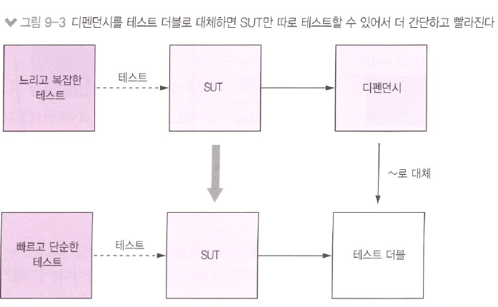</center>  
   
  - 테스트 더블은 목(mock), 스텁(stub) 두 종류임 
  - 스텁은 SUT에 값을 반환하는 용도로, 목은 SUT가 정확하게 디펜던시를 호출하는 지 확인하는 용도로 각각 쓰임
  - 목은 스텁의 일종이다. 
  - 사용 예제(9.2.5)는 OrderService 클래스용 테스트 더블로 OrderController 클래스만 따로 테스트 하는 방법 설명.   

   
#### 테스트 종류
 - 자동화 테스트의 네 가지 테스트 작성방법 - 범위(scope) 기준 분류 
    - 단위 테스트(unit test):서비스의 작은 부분(예: 클래스)테스트 
    - 통합 테스트(integration test):애플리케이션 서비스가 인프라 서비스(예:DB)및 타 애플리케이션 서비스와 잘 연동되어 작동하는 지 확인
    - 컴포넌트 테스트 (conponent test):개별 서비스에 대한 인수 테스트(acceptance test) 
    - 종단 간 테스트 (end to end test):전체 애플리케이션에 대한 인수 테스트 
   
      
#### 테스트 분류기준 

1)테스트 사분면 

<center> 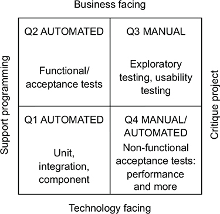</center>  

  - 브라이언 메릭이 창안한 테스트 사분면, 아래 두 가지 척도로 테스트를 분류--> 4개의 테스트 유형 도출 
    - 1 비즈니스에 관한 테스트 인가? 기술에 관한 테스트인가? 에 대한 지표 비교
    - 2 테스트를 하는 목적이 프로그래밍 지원인지, 어플리케이션의 평가를 위함인지 비교
 

2) 테스트 피라미드

 <center> 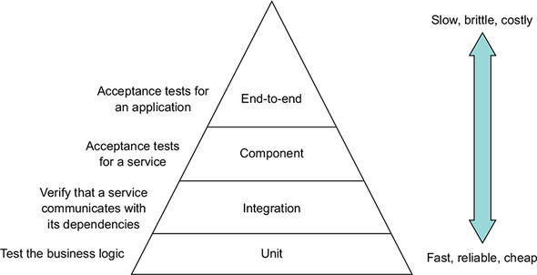</center>  
 
 - 서비스 테스트 역량을 어디에 집중할 지 가늠하는 데 쓰인다.
 - 피라미드 하부는 빠르고 간단하고 미더운 단위테스트가 상부는 느리고 복잡하고 취약한 종단 간 테스트가 위치함
 - 상부로 올라갈수록 작성하는 테스트 개수가 줄어든다.
 - 따라서, 일반적으로 단위테스트 개수는 많이, 종단 간 테스트는 적게 작성해야 한다. 
  
  
    
    
### 9.1.2 마이크로서비스 테스트
 - 화살표는 모두 의존성 방향이다
 - 
    <center> 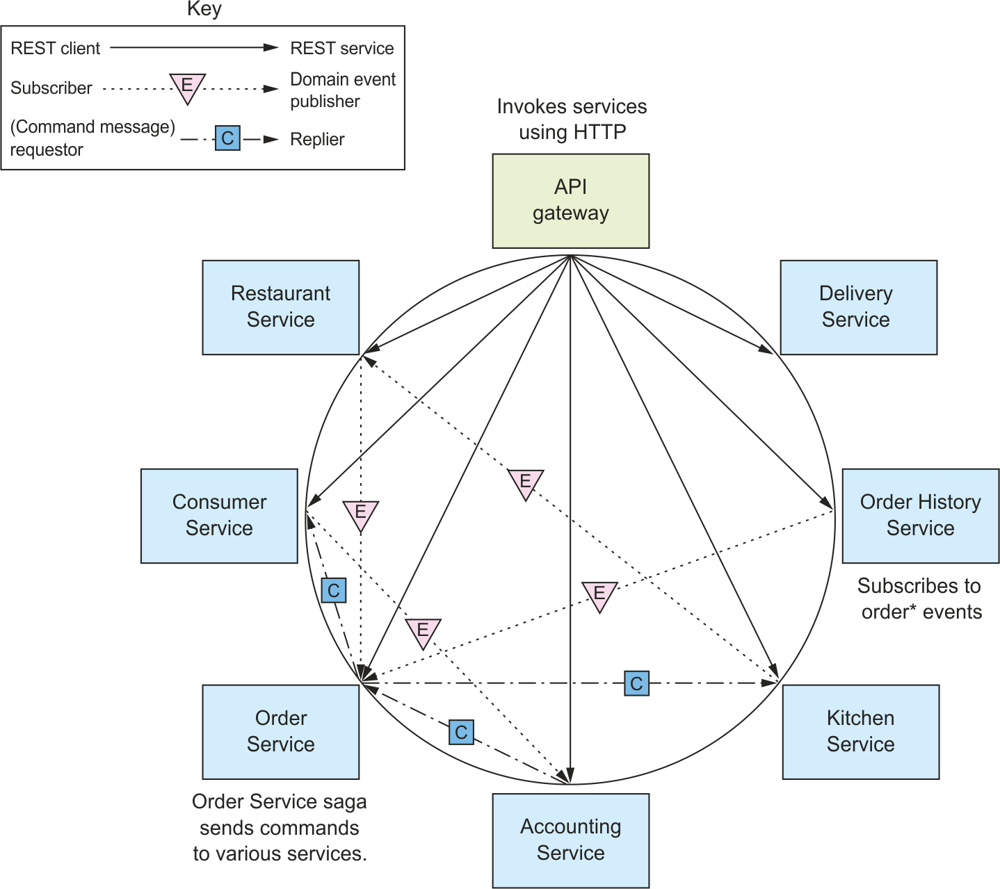</center>  
    
 - 컨슈머 주도 계약 테스트(consumer-driven contract test)를 활용하여 서비스만 따로 떼어내서 더 빠르고 간단한 테스트를 수행하는 것이 좋다 

#### 컨슈머 주도 계약 테스트 
 - API gateway에서 OrderServiceProxy는 GET /orders/{orderId} 를 테스트 한다고 가정시 관계
    - 컨슈머 : API gateway
    - 프로바이더 : 주문서비스
 - 컨슈머는 프로바이더가 다음과 같은 일을 하는 endpoint 가 구현되었는지 확인한다.
    - 컨슈머가 기대한 HTTP method, uri 인가?
    - 컨슈머가 기대한 헤더를 받는가? (헤더가 있는 경우)
    - 요청 본문을 받는가? (요청 본문이 있는 경우)
    - 컨슈머가 기대한 상태코드, 헤더, 본문이 포함된 응답인가? 
    
 - 컨슈머 계약 테스트의 초점은 프로바이더 API의 형상이 컨슈머가 기대하는 것과 부합하는 지 확인하는 것이다. 
 - 프로바이더의 비즈니스 로직을 빠짐없이 체크하는 테스트가 아닌, REST API의 컨슈머 계약 테스트는 목 컨트롤러 테스트이다
   <center> 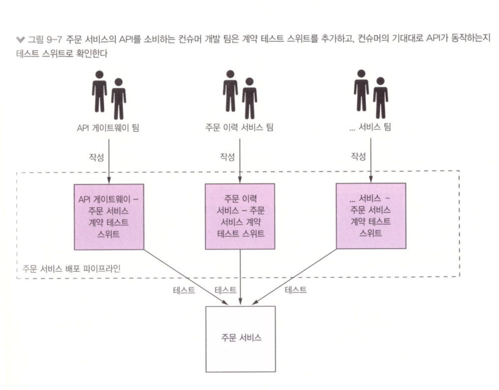</center>  
 -
 - "컨슈머 주도 계약 테스트"는 서비스가 클라이언트의 기대에 부합하는 지를 확인한다
 - 컨슈머 주도 계약 테스트는 사례에 의한 테스트를 한다 
 - 컨슈머/프로바이더 간 상호작용을 계약이라는 샘플 모음집으로 정의한다
 - 각 계약은 한 번의 상호작용 도중 주고받는 샘플 메시지로 구성된다 
 - 
 - "컨슈머 쪽 계약 테스트"는 클라이언트가 서비스와 통신 가능한 지를 확인한다. 
 - 계약대로 HTTP 요청을 하고 HTTP응답을 반환하는 지 확인하는 HTTP 스텁을 구성한다
 - 상호작용 양쪽을 다 테스트해 보고 컨슈머/프로바이더가 바라보는 API가 맞는지 확인하는 것임 
 
 


#### 서비스테스트: 스프링 클라우드 컨트랙트
  - 컨슈머 계약 테스트 프레임워크는 스프링 애플리케이션용 스프링 클라우드 컨트랙트와 팩트(Pact)프레임워크군이 유명함
  - 계약을 그루비 DSL 작성할 수 있게 지원함 
   <center> 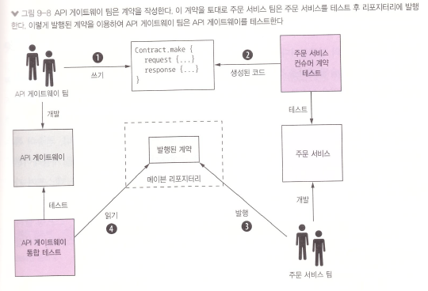</center>  
   
   1. 하나 이상의 계약(예제 9-1) 을 작성합니다. 각 계약은 API 게이트웨이가 주문 서비스에 전송할 HTTP요청과 기대되는 HTTP응답입니다.     
   2. 주문 서비스 팀은 컨슈머 계약 테스트로 주문 서비스를 테스트 합니다. 테스트 코드는 스프링 클라우드 컨트렉트에서 자동 생성됩니다.  
   3. 주문 서비스 팀은 주문 서비스를 테스트한 계약을 메이븐 저장소로 발행합니다. 
   4. 여러분은 주문 서비스 팀이 발행한 계약을 이용하여 API 게이트웨이 테스트를 작성합니다.
  - 예제9-1 API gateway가 주문서비스를 어떻게 호출하는 지 기술한 계약 
  
  ```java 
  org.springframework.cloud.contract.spec.Contract.make {
    request {
        method 'GET'
        url '/orders/99'
    }
    response {
        status 200
        headers {
            header('Content-Type': 'application/json;charset=UTF-8')
        }
        body('''{"orderId" : "99", "state" : "APPROVAL_PENDING"}''')
    }
}
  
  ```

#### 컨슈머 계약 테스트: 메시징 API
 - 컨슈머는 REST 클라이언트만 있는 것이 아니다. 
 - 도메인 이벤트를 구독하고 비동기 요청/응답 통신을 하는 서비스 역시 컨슈머이다. 
 - 다른 서비스의 메시징 API를 소비하고 이 API의 특성에 대해 가정을 하기 때문에 역시 컨슈머 계약 테스트를 작성해야 한다.
 - 스프링 클라우드 컨트랙트를 이용하면 메시징 기반의 상호작용도 테스트할 수 있다. 
    - 프로바이더 테스트는 이벤트 발생시키도록 만들고 그것이 계약과 일치하는지 확인.
    - 컨슈머 테스트는 이 이벤트를 컨슈머가 처리할수있는지 확인.(스텁 구독기, 10장에서 살펴봄)

  
  
  
  
### 9.1.3 배포 파이프라인
 - 배포 파이프라인은 Jenkins같은 CI 서버로 배포 파이프라인을 구축한다.
 - 배포 프로세스는 조직마다 상이할 수 있지만, "커밋 테스트 -> 통합 테스트 -> 컴포넌트 테스트 -> 배포"단계 순서로 구성
   <center> 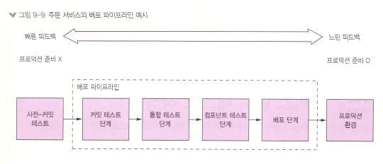</center>  


## 9.2. 서비스 단위 테스트 작성 

   <center> 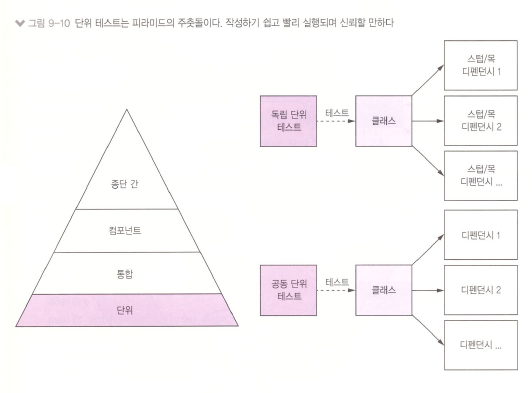</center>  
   
  - 단위테스트는 두 가지 종류가 있다    
    - 1. 독립(solitary)단위 테스트: 클래스 디펜던시를 목 객체로 나타내고 클래스를 따로 테스트   
    - 2. 공동(cociable)단위 테스트: 클래스와 디펜던시를 테스트    


<center> 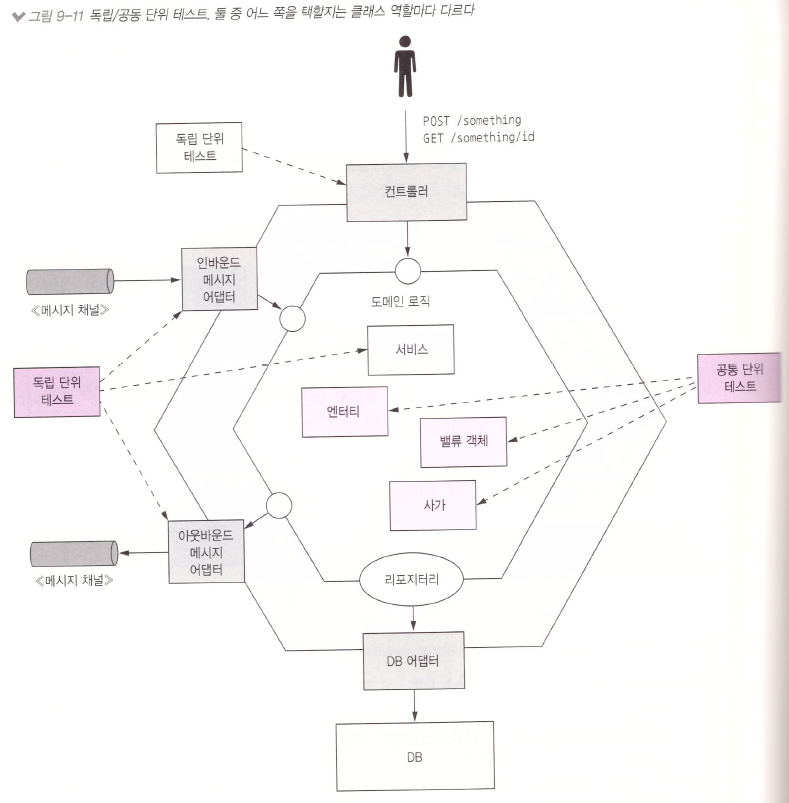</center> 
   - 독립/공동 단위 테스트, 둘 중 어느 쪽을 택할 지는 클래스 역할마다 다르다. 


### 9.2.1 단위 테스트 작성: 엔터티
 
 - 예제9-2 간단하고 실행이 빠른 Order 엔티티의 단위 테스트 


```java 
public class OrderTest {

  private ResultWithDomainEvents<Order, OrderDomainEvent> createResult;
  private Order order;

  @Before
  public void setUp() throws Exception {
    createResult = Order.createOrder(CONSUMER_ID, AJANTA_RESTAURANT, chickenVindalooLineItems());
    order = createResult.result;
  }

  @Test
  public void shouldCreateOrder() {
    assertEquals(singletonList(new OrderCreatedEvent(CHICKEN_VINDALOO_ORDER_DETAILS, RestaurantMother.AJANTA_RESTAURANT_NAME)), createResult.events);

    assertEquals(OrderState.APPROVAL_PENDING, order.getState());
    // ...
  }
```
- Order 클래스는 Money 밸류 객체에 의존한다. Money 밸류 객체도 반드시 함께 테스트 해야 한다. -> 공동 단위 테스트


### 9.2.2 단위 테스트 작성: 밸류 객체

 - 예제9-3 간단하고 실행이 빠른 Money 벨류 객체의 단위 테스트 

```java

public class MoneyTest {

  private final int M1_AMOUNT = 10;
  private final int M2_AMOUNT = 15;

  private Money m1 = new Money(M1_AMOUNT);
  private Money m2 = new Money(M2_AMOUNT);

  @Test
  public void shouldAdd() {
    assertEquals(new Money(M1_AMOUNT + M2_AMOUNT), m1.add(m2));
  }

  @Test
  public void shouldMultiply() {
    int multiplier = 12;
    assertEquals(new Money(M2_AMOUNT * multiplier), m2.multiply(multiplier));
  }


}
```
- Money 클래스는 의존하는 애플리케이션 클래스가 전혀 없다. -> 독립 단위 테스트


### 9.2.3 단위 테스트 작성: 사가
 - 중요한 비즈니스 로직이 구현된  CreateOrderSaga 클래스 같은 사가는 반드시 테스트 해야함 
 - 사가를 생성하고 사가가 참여자에게 기대한 순서대로 메시지를 전송하는 지 확인 
 -  사가가 롤백되는 다양한 테스트에 대해서도 테스트를 작성해야함 
 -  
 - 예제9-4 간단하고 실행이 빠른 주문 생성 사가의 단위 테스트 
```java
public class CreateOrderSagaTest {

  @Test
  public void shouldCreateOrder() {
    given()
        .saga(makeCreateOrderSaga(),
                new CreateOrderSagaState(ORDER_ID, CHICKEN_VINDALOO_ORDER_DETAILS)).
    expect().
        command(new ValidateOrderByConsumer(CONSUMER_ID, ORDER_ID,
                CHICKEN_VINDALOO_ORDER_TOTAL)).
        to(ConsumerServiceChannels.consumerServiceChannel).
    andGiven().
        successReply().
    expect().
      command(new CreateTicket(AJANTA_ID, ORDER_ID, null /* FIXME */)).
      to(KitchenServiceChannels.kitchenServiceChannel).
    andGiven().
        successReply().
    expect().
      command(new AuthorizeCommand(CONSUMER_ID, ORDER_ID, CHICKEN_VINDALOO_ORDER_TOTAL)).
      to(AccountingServiceChannels.accountingServiceChannel).
    andGiven().
        successReply().
    expect().
      command(new ConfirmCreateTicket(ORDER_ID)).
      to(KitchenServiceChannels.kitchenServiceChannel).
    andGiven().
        successReply().
    expect().
      command(new ApproveOrderCommand(ORDER_ID)).
      to(OrderServiceChannels.orderServiceChannel)
            ;
  }

  @Test
  public void shouldRejectOrderDueToConsumerVerificationFailed() {
    given()
        .saga(makeCreateOrderSaga(),
                new CreateOrderSagaState(ORDER_ID, CHICKEN_VINDALOO_ORDER_DETAILS)).
    expect().
        command(new ValidateOrderByConsumer(CONSUMER_ID, ORDER_ID,
                CHICKEN_VINDALOO_ORDER_TOTAL)).
        to(ConsumerServiceChannels.consumerServiceChannel).
    andGiven().
        failureReply().
    expect().
        command(new RejectOrderCommand(ORDER_ID)).
        to(OrderServiceChannels.orderServiceChannel);
  }
}


```


### 9.2.4 단위 테스트 작성: 도메인 서비스
 - 서비스 비즈니스 로직은 대부분 엔티티, 밸류객체, 사가로 구현하고 그 나머지는 도메인 서비스 클래스로 구현 
 - OrderServic는 도메인 서비스 클래스
 - 리포지터리 및 메시징 클래스 같은 디펜던시를 모킹한 독립단위 테스트 수행  
 - 테스트코드 작동 순서 
    - 1.설정: 서비스 디펜던시의 목 객체를 구성 
    - 2.실행: 서비스 메서드 호출 
    - 3.확인: 서비스 메서드가 올바른 값을 반환하고 디펜던시가 올바르게 호출되었는지 확인


 - 예제9-5 간단하고 실행이 빠른 OrderService 클래스의 단위 테스트 
```java
public class OrderServiceTest {

  private OrderService orderService;
  private OrderRepository orderRepository;
  private DomainEventPublisher eventPublisher;
  private RestaurantRepository restaurantRepository;
  private SagaManager<CreateOrderSagaState> createOrderSagaManager;
  private SagaManager<CancelOrderSagaData> cancelOrderSagaManager;
  private SagaManager<ReviseOrderSagaData> reviseOrderSagaManager;
  private OrderDomainEventPublisher orderAggregateEventPublisher;

  @Before
  public void setup() {
    orderRepository = mock(OrderRepository.class);
    eventPublisher = mock(DomainEventPublisher.class);
    restaurantRepository = mock(RestaurantRepository.class);
    createOrderSagaManager = mock(SagaManager.class);
    cancelOrderSagaManager = mock(SagaManager.class);
    reviseOrderSagaManager = mock(SagaManager.class);

    // Mock DomainEventPublisher AND use the real OrderDomainEventPublisher

    orderAggregateEventPublisher = mock(OrderDomainEventPublisher.class);

    orderService = new OrderService(orderRepository, eventPublisher, restaurantRepository,
            createOrderSagaManager, cancelOrderSagaManager, reviseOrderSagaManager, orderAggregateEventPublisher, Optional.empty());
  }


  @Test
  public void shouldCreateOrder() {
    when(restaurantRepository.findById(AJANTA_ID)).thenReturn(Optional.of(AJANTA_RESTAURANT));
    when(orderRepository.save(any(Order.class))).then(invocation -> {
      Order order = (Order) invocation.getArguments()[0];
      order.setId(ORDER_ID);
      return order;
    });

    Order order = orderService.createOrder(CONSUMER_ID, AJANTA_ID, CHICKEN_VINDALOO_MENU_ITEMS_AND_QUANTITIES);

    verify(orderRepository).save(same(order));

    verify(orderAggregateEventPublisher).publish(order,
            Collections.singletonList(new OrderCreatedEvent(CHICKEN_VINDALOO_ORDER_DETAILS, RestaurantMother.AJANTA_RESTAURANT_NAME)));

    verify(createOrderSagaManager).create(new CreateOrderSagaState(ORDER_ID, CHICKEN_VINDALOO_ORDER_DETAILS), Order.class, ORDER_ID);
  }

  // TODO write tests for other methods

}

```


### 9.2.5 단위 테스트 작성: 컨트롤러
 - OrderService 클래스용 테스트 더블로 OrderController 클래스만 따로 테스트 하는 방법
 - OrderController가 의존하는 목을 사용한 독립 단위 테스트 
 
 - 예제9-6 간단하고 실행이 빠른 OrderController클래스의 단위 테스트 
```java
public class OrderControllerTest {

  private OrderService orderService;
  private OrderRepository orderRepository;
  private OrderController orderController;

  @Before
  public void setUp() throws Exception {
    orderService = mock(OrderService.class);
    orderRepository = mock(OrderRepository.class);
    orderController = new OrderController(orderService, orderRepository);
  }


  @Test
  public void shouldFindOrder() {

    when(orderRepository.findById(1L)).thenReturn(Optional.of(CHICKEN_VINDALOO_ORDER));

    given().
            standaloneSetup(configureControllers(orderController)).
    when().
            get("/orders/1").
    then().
            statusCode(200).
            body("orderId", equalTo(new Long(OrderDetailsMother.ORDER_ID).intValue())).
            body("state", equalTo(OrderDetailsMother.CHICKEN_VINDALOO_ORDER_STATE.name())).
            body("orderTotal", equalTo(CHICKEN_VINDALOO_ORDER_TOTAL.asString()))
    ;
  }

  @Test
  public void shouldFindNotOrder() {
    when(orderRepository.findById(1L)).thenReturn(Optional.empty());

    given().
            standaloneSetup(configureControllers(new OrderController(orderService, orderRepository))).
    when().
            get("/orders/1").
    then().
            statusCode(404)
    ;
  }

  private StandaloneMockMvcBuilder configureControllers(Object... controllers) {
    CommonJsonMapperInitializer.registerMoneyModule();
    MappingJackson2HttpMessageConverter converter = new MappingJackson2HttpMessageConverter(JSonMapper.objectMapper);
    return MockMvcBuilders.standaloneSetup(controllers).setMessageConverters(converter);
  }

}
```


### 9.2.6 단위 테스트 작성: 이벤트/메시지 핸들러
 - OrderEventConsumer가 각 이벤트를 적절한 핸들러로 라우팅해서 OrderService가 올바르게 호출되었는지 확인한다.

 - 예제9-7 간단하고 실행이 빠른 OrderEventConsumer 클래스의 단위 테스트 
```java
public class OrderEventConsumerTest {

  private OrderService orderService;
  private OrderEventConsumer orderEventConsumer;

  @Before
  public void setUp() throws Exception {
    orderService = mock(OrderService.class);
    orderEventConsumer = new OrderEventConsumer(orderService);
  }

  @Test
  public void shouldCreateMenu() {

    CommonJsonMapperInitializer.registerMoneyModule();

    given().
            eventHandlers(orderEventConsumer.domainEventHandlers()).
    when().
            aggregate("net.chrisrichardson.ftgo.restaurantservice.domain.Restaurant", AJANTA_ID).
            publishes(new RestaurantCreated(AJANTA_RESTAURANT_NAME, RestaurantMother.AJANTA_RESTAURANT_MENU)).
    then().
       verify(() -> {
         verify(orderService).createMenu(AJANTA_ID, AJANTA_RESTAURANT_NAME, new RestaurantMenu(RestaurantMother.AJANTA_RESTAURANT_MENU_ITEMS));
       })
    ;

  }

}
```


## 9.3. 마치며 
 - 마이크로서비스 아키텍처의 장점을 십분 활용하려면 반드시 테스트를 자동화 해야합니다. 
 - 테스트의 목적은 SUT(테스트 대상 시스템)의 동작을 확인하는 것입니다. 
 - 테스트 스위트는 서로 연관된 테스트를 모아놓은 꾸러미 입니다. 
 - 테스트를 단순화하고 재빨리 실행하려면 테스트 더블을 이용하세요. 
 - 테스트 더블은 스텁과 목 두가지 종류가 있습니다. 
 - 스텝은 SUT에 값을 반환하는 용도로, 목은 SUT가 정확하게 디펜던시를 호출하는 지 확인하는 용도로 각각 쓰입니다. 
 - 일반적으로, 실행이 빠르고 결과가 확실하며 코드를 작성하기 쉬운 단위테스트 작성하는 것이 좋습니다. 

