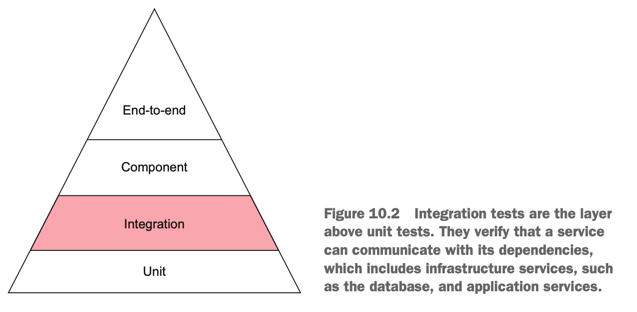
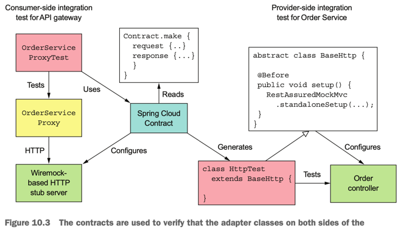
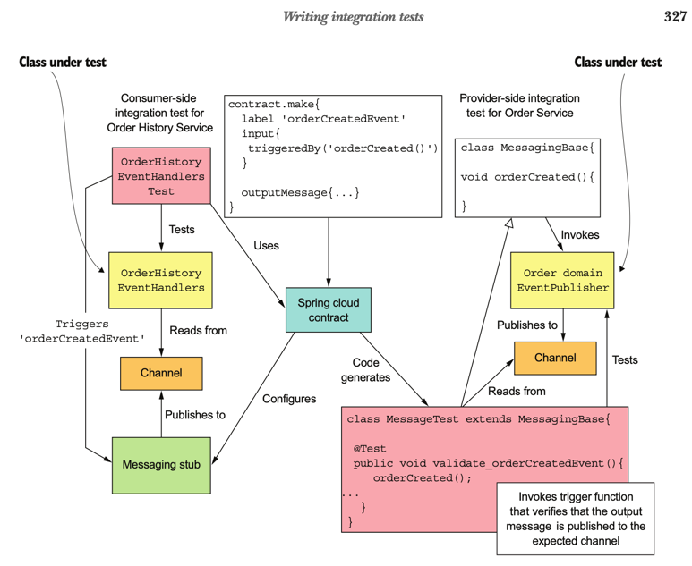
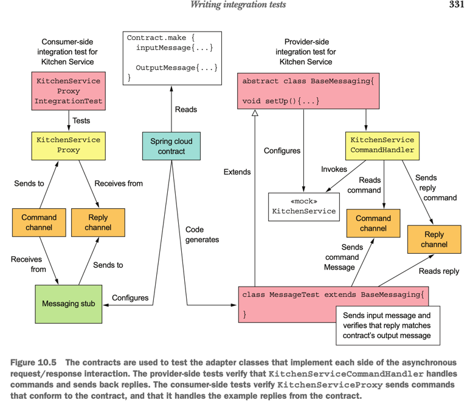
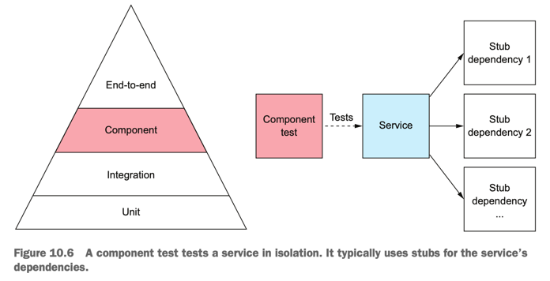
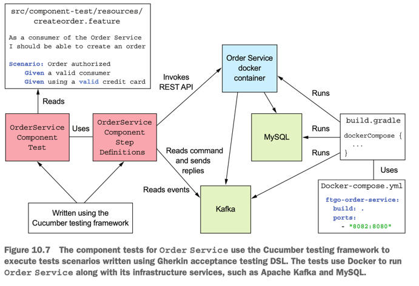

# 마이크로서비스 패턴

## Chapter 10. 마이크로서비스 테스트 2부
> - 단위테스트 -> 통합테스트 -> 컴포넌트 테스트 -> 종단 간 테스트 

### 개요
- 10.1 통합 테스트 작성
- 10.2 컴포넌트 테스트 개발
- 10.3 종단 간 테스트 작성
- 10.4 마치며


### 시작

- 단위테스트
- 통합테스트
  - 인프라 서비스, 타 애플리케이션 서비스와 적절히 연동되즌지 확인하는 테스트
    - DB, RestTemplate, ..
- 컴포넌트 테스트
  - 서비스에 대한 인스 테스트. 디펜던시를 스터빙하여 서비스를 따로 테스트
- 종단 간 테스트
  - 서비스 그룹 또는 전체 애플리케이션을 대상으로 하는 테스트
  - 가능한 적게 사용 권장

### 10.1 통합 테스트 작성
- inbound / outbound 테스트

#### 10.1.0. 개요
- 서비스가 잘 동작하는지는 인프라 서비스, 타 애플리케이션 서비스와 적절히 상호 작용하는지 확인해봐야 알 수 있음
- 서비스를 전부 띄워 놓고 일일이 API를 호출해 보는 종단 간 테스트가 가장 확실하나, 느리고 리소스가 많으 듦
- 따라서 종단간 테스트 횟수는 줄이고 통합 테스트를 작성하는 것이 바람직 함
- 통합 테스트에는 두 가지 전략이 있음
  - 각 서비스의 어댑터를 테스트 : 연동 클래스 단위 테스트(adapter, repository..)
  - 계약(wiremock)을 활용하는 전략 : 컨슈머/프로바이더 둘 다 테스트해서 서로 바라보는 API가 일치하는지 확인
    - 컨슈머(소비자) / 프로바이더 어댑터 테스트 : 어댑터 디펜던시를 wiremock 설정 후 테스트

#### 10.1.1. 통합 테스트 : 영속화(DB repository)
- 대부분의 서비스는 DB에 데이터를 저장하고, 저장 통합 테스트를 작성해서 DB 접근 로직이 잘 동작하는지 확인 할 수 있음
- JPA 리포지터리의 경우 영속화 통합 테스트 절차는 아래와 같음
  - 설정(setup) : DB 스키마 생성하고 known 상태로 초기화 하는 DB 설정
  - 실행(execute) : DB 작업 수행
  - 확인(verify) : DB 상태, 그리고 DB에서 조회한 객체를 단언
  - 정리(teardown) : 설정 단계에서 시작한 트랜잭션을 롤백하는 등 DB에 변경한 내용을 rollback 해야 할 경우 필요한 단계
- 영속화 통합 테스트는 JPA 기술로 DB 스키마 생성하는 것 외에는 어떠한 변경도 하지 않으니 롤백할 필요도 없고 메모리에 데이터 변경분이 캐시되는 ORM 특유의 문제도 막을 수 있음
- 테스트 DB 인스턴스는 docker 통해서 프로비저닝(provisioning) 가능함

#### 10.1.2. 통합 테스트 : REST 요청/응답형 상호 작용(restTemplate, controller)
- 통합 테스트는 컨슈머 주도 계약 테스트를 활용하는 것이 좋음
  - wiremock : HTTP 서버를 효과적으로 모킹하는 툴
- API 게이트웨이와 엔드포인트 간 상호 작용은 HTTP 기반의 계약들로 기술 할 수 있음
- 컨슈머 입장의 테스트는 HTTP 스텁 서버(mock-server)를 구성하고 요청/응답을 정의해서 사용함
- 프로바이더 입장의 테스트는 아래와 같음
  - 스프링 클라우드 컨트랙트는 이런 계약을 이용하여 통합 테스트 코드를 generate 함
  - 이 통합 테스트로 스프링 mock MVC나 레스트 어슈어드 mock MVC 를 이용하여 컨트롤러를 테스트 함

- REST API 계약 예제
```
org.springframework.cloud.contract.spec.Contract.make {
    request {
        method 'GET'
        url '/orders/1223232'
    }
    response {
        status 200
        headers {
            header('Content-Type': 'application/json;charset=UTF-8')
        }
        body('''{"orderId" : "1223232", "state" : "APPROVAL_PENDING"}''')
    }
}
```

#### 10.1.3. 통합 테스트 : 발행/구독 스타일 상호 작용(이벤트 기반)
- 이벤트 기반 서비스의 통합 테스트는 프로듀서/컨슈머가 바라보는 메세지 채널 및 도메인 이벤트 구조가 서로 일치하는지 확인 함

- 이벤트 기반 계약 예제
  - label : 컨슈머 테스트에서 스프링 컨트랙트가 이벤트 발행을 트리거하기 위해 사용하는 엘리먼트
  - triggeredBy: 코드-생성된 테스트 메서드가 이벤트 발행을 트리거하기 위해 호출하는 상위 클래스의 메서드 명
```
package contracts;
org.springframework.cloud.contract.spec.Contract.make {
    label 'orderCreatedEvent'
    input {
     triggeredBy('orderCreated()')
    }
    outputMessage {
        sentTo('net.chrisrichardson.ftgo.orderservice.domain.Order')
        body('''{"orderDetails":{"lineItems":[{"quantity":5,"menuItemId":"1",
                 "name":"Chicken Vindaloo","price":"12.34","total":"61.70"}],
                 "orderTotal":"61.70","restaurantId":1,"consumerId":1511300065921},"orderState":"APPROVAL_PENDING"}''')
        headers {
            header('event-aggregate-type',
                        'net.chrisrichardson.ftgo.orderservice.domain.Order')
            header('event-aggregate-id', '1')
        }
    }
}
```

#### 10.1.4. 통합 테스트 : 비동기 요청/응답 상호 작용
- 비동기 요청/응답 형태로 상호 작용하는 서비스도 메세지 기반으로 테스트 가능함
- HTTP 계약 테스트 방식과 거의 유사하게 동작

- 비동기 요청/응답 계약 예제
```
package contracts;
org.springframework.cloud.contract.spec.Contract.make { 
    label 'createTicket'
    input { 
        messageFrom('kitchenService') 
        messageBody('''{"orderId":1,"restaurantId":1,"ticketDetails":{...}}''')
        messageHeaders {
            header('command_type','net.chrisrichardson...CreateTicket') header('command_saga_type','net.chrisrichardson...CreateOrderSaga') header('command_saga_id',$(consumer(regex('[0-9a-f]{16}-[0-9a-f] 
        }
    }
    outputMessage { 
        sentTo('net.chrisrichardson...CreateOrderSaga-reply') 
        body([ticketId: 1]) 
        headers {
            header('reply_type', 'net.chrisrichardson...CreateTicketReply')
            header('reply_outcome-type', 'SUCCESS') 
        }
    }
}
```


### 10.2 컴포넌트 테스트 개발
- service layer case 별 sequence 테스트

#### 10.2.0 개요
- 컴포넌트 테스트는 모든 디펜던시를 각자의 동작을 모킹한 스텁으로 대체하고, 서비스를 따로 분리하여 그 동작을 확인함
- 컴포넌트 테스트는 종단 간 테스트에 비해 작성하기 쉽고 실행 속도가 빠름
- 컴포넌트 테스트는 서비스만 따로 테스트하고, 서비스 디펜던시는 보통 스텁으로 대체함


#### 10.2.1 인수 테스트 정의
- 인수 테스트는 소프트웨어 컴포넌트의 비즈니스와 연관된 테스트
- 내부 구현보다는 클라이언트 관점에서 어떤 동작이 외부에 드러나야 하는지 테스트 (서비스 API 관점에서 시나리오로 기술)
  - 예시) 승인 된 금액보다 많은 금액을 환불하는 경우 환불 불가하다.

#### 10.2.2 인수 테스트 작성 : 거킨(Gherkin)
- 거킨은 실행 가능한 명세를 작성하는 DSL
- 일상 언어로 작성한 시나리오 형태로 인수 테스트를 정의한 후, 큐컴버(Cucumber)라는 거킨 전용 테스트 자동화 프레임워크를 이용하여 명세를 실행
- 거킨 명세 및 큐컴버 실행 예제
```
// Gherkin
Feature: Place Order
          As a consumer of the Order Service
          I should be able to place an order
          Scenario: Order authorized
           Given a valid consumer
           Given using a valid credit card
           Given the restaurant is accepting orders
           When I place an order for Chicken Vindaloo at Ajanta
           Then the order should be APPROVED
           And an OrderAuthorized event should be published
```
```
// Cucumber
public class StepDefinitions ...  {
  ...
  @Given("A valid consumer") // 설정
  public void useConsumer() { ... }
  
  @Given("using a(.?) (.*) credit card")
  public void useCreditCard(String ignore, String creditCard) { ... }
  
  @When("I place an order for Chicken Vindaloo at Ajanta") // 실행
  public void placeOrder() { ... }
  
  @Then("the order should be (.*)") // 확인
  public void theOrderShouldBe(String desiredOrderState) { ... }
  
  @And("an (.*) event should be published") // 확인
  public void verifyEventPublished(String expectedEventClass)  { ... }
}
```

#### 10.2.3 컴포넌트 테스트 설계
- 컴포넌트 테스트는 연관 된 여러 서비스의 디펜던시 스텁을 설정해야 함
- 서비스 외에도 DB, 메세지 인프라 등 구성도 필요함
  - in-process component test
    - H2 등 인메모리 스텁 구성
    - 작성이 간단하고 빠르게 실행되지만, 배포 가능한 서비스를 테스트 할 수 없음
  - out-of-process component test
    - DB, 메세지 브로커는 실제 인프라 서비스를 사용하고, 애플리케이션 기반 서비스는 스텁으로 대신 함
    - 서비스를 도커 컨테이너 이미지로 패키징하는 방법이 일반화되는 추세
    - 작성하기 복잡하고, 실행이 느리고 취약 할 수 있음
  - out-of-process component test - service stubbing
    - 스텁을 내부에 구성하여 간단하게 테스트 : wiremock으로 HTTP 스텁 구성

#### 10.2.4 컴포넌트 테스트 작성 : 주문 서비스
- 큐컴버 테스트 프레임워크를 이용하여 거킨 인수 테스트 DSL 테스트 시나리오 실행
- 아파치 카프카, MySQL 등의 인프라 서비스와 주문 서비스를 도커로 실행 후 테스트



### 10.3 종단 간 테스트 작성
- 실 배포 된 서비스 테스트

#### 10.3.0 개요
- 종단 간 테스트는 애플리케이션 전체를 테스트
- 느리고 취약하고, 개발 소요 시간이 긺
- 수 많은 서비스와 인프라 서비스까지 함께 배포해야하므로 느리며 가능한 그 수를 줄이는 편이 좋음
  - 샌드박스 테스트 정도로 생각한다면 적절히 시나리오 작성하면 좋을 듯

### 10.3.1 종단 간 테스트 설계/작성/실행
- 비즈니스와 관련된 테스트 이므로 업무 담당자가 이해할 수 있는 고수준의 DSL로 작성하는 것이 좋음 (거킨)
- 해당 테스트를 실행하려면 전체 애플리케이션이 실행되어야 함(비용이 비쌈)

### 10.4 마치며
- 서비스 간 상호 작용 테스츠 시에는 contract를 활용하면 좋다.
- 서비스가 API를 통해 잘 동작하는지는 컴포넌트 테스트를 작성하여 확인한다. 디펜던시는 스터빙하여 테스트를 단순/신속 수행하는 것이 좋다.
- 느리고 취약하고 시간 리소스 소모가 큰 종단 간 테스트는 가급적 줄이면 좋다. (오버헤드 줄이기)

<br>

## Reference
- Chris Richardson - Microservices Patterns
