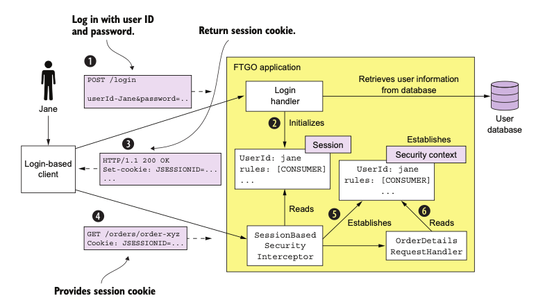
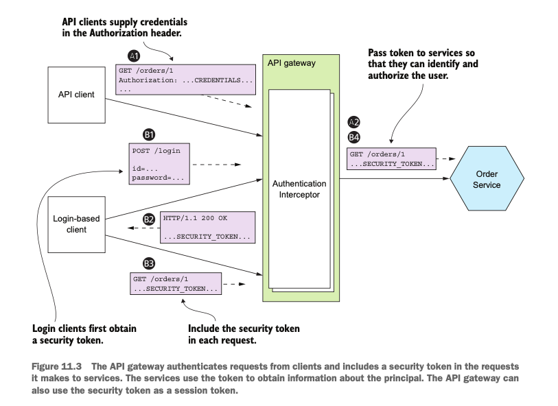
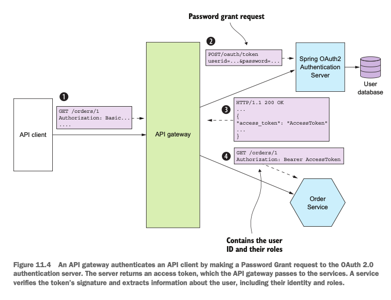
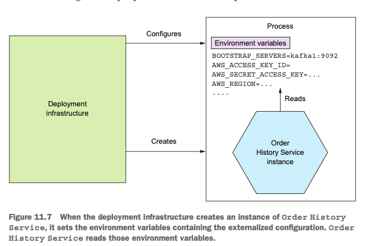
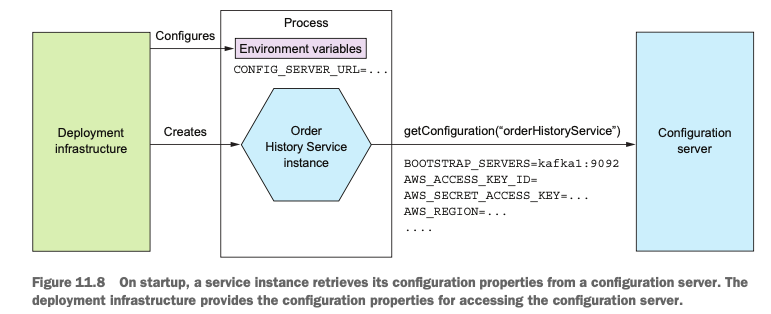
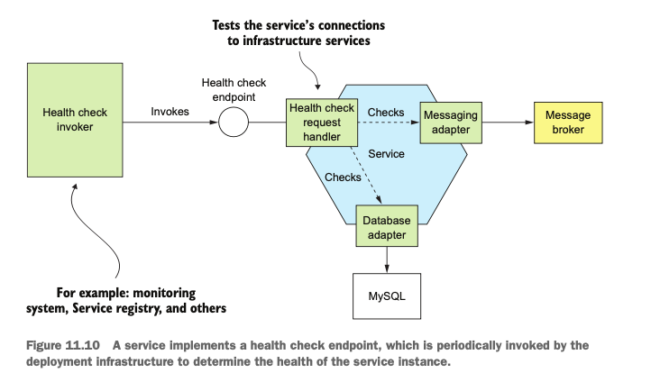
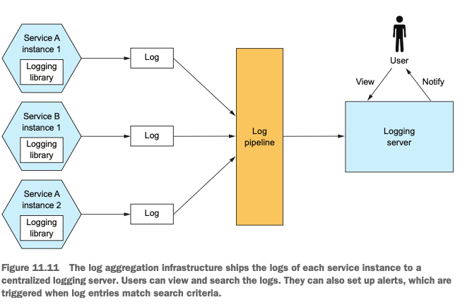

# 마이크로서비스 패턴

## Chapter 11. 프로덕션 레디 서비스 개발

> - 보안 서비스 개발
> - 외부화 구성 패턴 적용
> - 관측성 패턴 적용
> - 마이크로서비스 섀시 패턴을 응용한 서비스 개발 단순화

 

### 개요

- 11.1 보안 서비스 개발
- 11.2 구성 가능한 서비스 설계
- 11.3 관측 가능한 서비스 설계
- 11.4 서비스 개발: 마이크로서비스 섀시 패턴
- 11.5 마치며

 

### 11.1 보안 서비스 개발

애플리케이션 개발자가 구현하는 네 가지 보안 요소

- 인증 : 애플리케이션에 접근하는 애플리케이션이나 사람의 신원 확인, 사용자ID/PW 또는 애플리케이션의 API 키/시크릿 등
- 인가 : 주체가 어떤 데이터에 어떤 작업을 요청하여 수행할 수 있는 권한이 있는지 확인. 역할기반 및 ACL(접근제어리스트)
- 감사 : 보안 이슈 탐지, 컴플라이언스(법규준수/준법감시/내부통제) 시행
- 보안 IPC : 모든 서비스를 드나드는 통신이 TLS(Transport Layer Security)를 경유하는 것이 갖이 가장 이상적임

#### 기존 모놀리식 애플리케이션의 보안

- 보안 아키텍처의 핵심은 세션(session), 세션 토큰으로 식별하며, 클라이언트는 요청시 세션토큰을 같이 넣어서 보낸다.
- 주체의 ID와 역할을 세션에서 보관, 암호학적으로 강력한 무작위 숫자등으로 알아보기 어렵게 만들어야 함.
- 보안 컨텍스트도 중요한 요소, 현재 요청을 보낸 사용자 정보를 저장
- 스프링 시큐리티 프레임워크는 정적 스레드 로컬변수에 저장하여 모든 요청 핸들러 코드가 얼마든지 보안 컨텍스트에 접근할 수 있다.

이벤트 순서

1. 클라이언트가 애플리케이션에 로그인 요청
2. LoginHandler가 로그인 요청 처리 (자격증명 확인, 세션 생성, 세션에 주체 정보 저장)
3. LoginHandler가 클라이언트에 세션 토큰 반환
4. 클라이언트는 이후 모든 요청에 세션 토큰을 포함
5. 클라이언트 요청 시 SessionBasedSecurityInterceptor가 세션토큰을 확인한 후, 보안 컨텍스트를 설정
6. 요청 핸들러는 보안 컨텍스트를 이용해 권한 확인 후 신원 획득

 

### 마이크로서비스 아키텍처에서의 보안 구현

> 마이크로서비스 아키텍처는 모든외부 요청을 API 게이트웨이와 하나 이상의 서비스가 처리하는 분산 시스템이다, 각 서비스는 나름대로 보안을 구현해야 한다.  
> 모놀리식 애플리케이션의 설계를 그대로 배껴 쓸 수 없기 때문에 보안 구현이 어렵다.

- 인-메모리 보안 컨텍스트 : 서비스는 메모리를 공유할 수 없으므로 인-메모리 보안 컨텍스트로 사용자 신원을 전달할 수 없다.
- 중앙화 세션 : 느슨한 결합 원칙에 위배되기는 하지만 이론상 여러 서비스가 DB 기반의 세션에 접근하는 것은 가능

### API 게이트웨이에서 인증 처리

- 요청을 서비스에 보내기 전에 API 게이트웨이가 요청을 인증하는 것이 좋다.
- 인증 로직을 중앙화하면 나중에 문제가 생겨도 한 곳만 바로잡으면 되기 때문에 보안 취약점이 노출될 가능성이 현저히 줄어듦
- 다양한 인증 메커니즘을 구현한 복잡한 코드도 서비스에서 감출 수 있다.
- API 게이트웨이는 요청을 인증한 후, 하나 이상의 서비스를 호출한다.

이벤트 순서

1. 클라이언트는 자격증명이 포함된 요청을 전송
2. API 게이트웨이는 자격증명을 인증하고, 보안 토큰을 생성해서 서비스들에 전달

 

### 인가 처리

- 해당 클라이언트가 요청한 작업을 할 수 있도록 허가되었는지 검사흐는 인가 매커니즘도 중요함
- 스프링 시큐리티 같은 보안 프레임워크를 이용하면 비교적 간단히 구현 가능
- API GW에 인가 로직을 두면, API GW와 서비스가 단단히 결합하게 되어서 나중에 변경이 어려울 수 있음
- 역할 기반의 URL 경로 접근만 구현할 수 있음
- 인가 로직은 서비스에 구현하는 것이 좋다.

### JWT로 사용자 신원/역할 전달

> API 게이트웨이가 어떤 종류의 토큰에 사용자 정보를 담아 서비스에 전달할지 결정해야 한다.

- 난독화 토큰
  - 보통 UUID를 많이 사용함.
  - 성능 및 가용성이 떨어지고 지연시간이 길다는 것이 단점
  - 토큰 수신자가 토큰의 유효성을 검증하고 보안 서비스를 동기 RPC 호출하여 사용자 정보를 조회해야 하기 때문
- JWT
  - 두 당사자 간의 사용자 신원/역할 등의 정보를 안전하게 표현하는 수단,
  - 사용자 정보, 만료일자 등 각종 메타데이터가 포함된 JSON 객체를 페이로드에 담아 JWT 생성자와 수신자만 알 수 있는 시크릿으로 서명
  - 위.변조하기는 거의 불가능
  - 취소가 불가능하기 때문에 탈취당할 수 있음. -> 유효시간을 짧게 설정

### OAuth 2.0 응용

> OAuth 2.0은 깃허브나 구글 등 퍼블릭 클라우드 서비스 사용자가 자기 정보에 접근하려는 서드파티 애플리 케이션을 패스워드 노출 없이 허가할 수 있는 방안을 찾다가 정착된 인증 프로토콜이다.

OAuth의 핵심개념

- 인증서버 : 사용자 인증 및 액세스/리프레시 토큰 획득 API 제공, 스프링 OAuth는 OAuth 2.0 인증 서버를 구축하는 대표적인 프레임워크
- 액세스 토큰 : 리소스 서버 접근을 허가하는 토큰, 스프링 OAuth는 JWT 사용
- 리프레시 토큰 : 클라이언트가 새 액세스 토큰을 얻기 위해 필요한 토큰, 수명은 길지만 취소 가능한 토큰
- 리소스 서버 : 액세스 토큰으로 접근을 허가하는 서비스, MSA 에서의 서비스
- 클라이언트 : 리소스 서버에 접근하려는 클라이언트, MSA 에서의 API GW

이벤트 순서

1. 클라이언트는 기본 인증을 이용하여 자격증명과 함께 요청.
2. API GW는 OAuth 2.0 인증 서버에 패스워드 승인을 요청
3. 인증 서버는 API 클라이언트의 자격증명을 검증하고 액세스/리프레시 토큰을 반환
4. API GW는 서비스에 요청할 떄마다 받은 액세스 토큰을 넣어 보내고, 서비스는 액세스 토큰을 이용하여 요청을 인증한다.

 

### 11.2 구성 가능한 서비스 설계

> 런타임에 구성 프로퍼티 값을 서비스에 제공하는 외부화 구성 메커니즘은 구현 방식에 따라 푸시/풀 두가지 모델이 있다.

- 푸시 모델(push model) : OS 환경 변수, 구성 파일 등을 통해 배포 인프라에서 서비스로 프로퍼티 값을 전달.
- 풀 모델(pull model) : 서비스 인스턴스가 구성 서버에 접속해서 프로퍼티 값을 읽어옴.

### 푸시 기반의 외부화 구성

- 배포 환경은 서비스 인스턴스가 생성될 때 프로퍼티 값을 제공한다.
- 환경변수를 통해 값을 전달하는 방식

 

### 풀 기반의 외부화 구성

- 서비스 인스턴스가 시동 시 자신이 필요한 값을 구성 전용 서버에 접속하여 읽는 방식
- 구성서버는 여러 가지 방법으로 구현할 수 있다.
  - 버전 관리 시스템(예: 깃, SVN)
  - SQL / NoSQL DB
  - 전용 구성 서버(예: 스프링 클라우드 컨피그 서버), 자격증명등 민감한 데이터를 보관하는 해시코프 볼트, AWS 파라미터 스토어
- 장점
  - 중앙화 구성 : 모든 구성 프로퍼티를 한곳에서 관리하면 간편하고, 중복 프로퍼티 제거
  - 민감한 데이터의 투명한 복호화 : 프로퍼티를 자동 복호화해서 서비스에 전달
  - 동적 재구성 : 수정된 프로퍼티 값을 폴링 등으로 감지해서 자동 재구성

 

### 11.3 관측 가능한 서비스 설계

> 개발자가 서비스 인스턴스의 동작과 헬스가 표출되도록 개발하면 운영자가 좀 더 쉽게관리하고 트러블슈팅할 수 있다.

관측 가능한 서비스를 설계하는 패턴

- 헬스 체크 API : 서비스 헬스를 반환하는 끝점을 표출
- 로그 수집 : 서비스 활동을 로깅하면서 검색/경고 기능이 구현된 중앙 로그 서버에 로그를 출력
- 분산 추적 : 각 외부 요청에 ID를 하나씩 붙여 서비스 사이를 드나드는 과정을 추적
- 예외 추적 : 예외 중복 제거, 개발자 알림, 예외별 해결 상황 추적 등을 수행하는 예외 추적 서비스에 예외를 보고
- 애플리케이션 지표 : 서비스는 카운터, 게이지 등 지표를 유지하고, 수집한 데이터를 지표 서버에 표출한다.
- 감사 로깅 : 사용자 액션을 로깅

### 헬스 체크 API

- 서비스 인스턴스는 자신이 요청을 처리할 수 있는 상태인지 여부를 배포 인프라에 알려야 한다.
- 배포 인프라가 호출 가능한 헬스 체크 끝점을 서비스에 구현하는 것이 좋은 방법이다. ex) 액추에이터
- 헬스 체크 끝점 구현 : 서비스 인스턴스의 상태를 판단, 외부 인프라 서비스에 접근 가능한지 확인
- 헬스 체크 끝점 호출 : 배포 인프라가 헬스 체크 끝점을 호출하도록 구성

 

### 로그 수집 패턴

- 로그는 소중한 트러블슈팅 도구
- 모든 서비스 인스턴스가 남긴 로그를 로그 수집 파이프라인을 통해 중앙 로깅서버로 보내서 관리함.
- 대표적인 로깅 인프라
  - 일래스틱서치 : 로깅 서버로 쓰이는 텍스트 검색 지향 NoSQL DB
  - 로그스태시 : 서비스 로그를 수집하여 일래프틱서치에 출력하는 로그 파이프라인
  - 키바나 : 일래스틱서치 전용 시각화 툴

 

### 분산 추적 패턴

- 외부 요청마다 유일한 ID를 하나씩 부여해서 한 서비스에서 다음 서비스로 흘러가는 과정을 기록하고, 시각화/분석 기능을 제공하는 중앙화 서버에 자료를 남긴다.

### 애플리케이션 지표 패턴

- 모니터링 시스템은 기술 스택의 모든 부분에서 지표를 수집하여 중요한 애플리케이션 헬스 정보를 제공
- 수집하는 지표는 인프라 수준(CPU, 메모리, 디스크 사용률)부터 애플리케잇녀 수준(서비스 요청 지연 시간, 실행 요청 수)까지 다양함.
- ex) 마이크로미터 메트릭스, 그라파나

### 예외 추적 패턴

- 중복된 예외를 제거하고, 알림을 생성하고, 예외 해결 과정을 관리하는 중앙 서비스에 예외를 보고한다.
- 운영이슈를 신속하게 발견하여 대응할 수 있게 해주는 수단

### 감사 로깅 패턴

- 고객 지원, 컴플라이언스 준수, 수상한 동작 감지를 위해 사용자 액션을 DB에 저장
- 감사로깅을 비즈니스 로직에 추가 -> 관리가 쉽지 않음
- AOP, 이벤트 소싱 활용

### 11.4 서비스개발 : 마이크로서비스 섀시 패턴

> 예외추적, 로깅, 헬스 체크, 외부화 구성, 분산 추적 등의 횡단 관심사를 처리하는 프레임워크를 기반으로 서비스를 구축한다.

### 마이크로서비스 섀시

- 외부화 구성, 헬스 체크, 애플리케이션 지표, 서비스 디스커버리, 회로 차단기, 분산 추적
- 마이크로서비스 섀시를 적용하면 개발자가 작성해야 할 코드가 줄어 비즈니스 로직에 집중할 수 있다.

### 이제는 서비스 메시로

> 회로 차단기, 분산 추적, 서비스 디스커버리, 부하 분산, 룰 기반 트래픽 라우팅 등 다양한 관심사가 구현된 네트워킹 계층을 통해 서비스를 드나드는 모든 네트워크 트래픽을 라우팅한다.

- 서비스 매시는 한 서비스와 다른 서비스, 그리고 외부 애플리케이션 간의 소통을 조정하는 인프라
- 마이크로서비스 섀시는 외부화 구성, 헬스 체크 등 애플리케이션 코드와 단단히 결합된 관심사만 구현하면 되기 때문에 단순해짐

 
 

### 11.5 마치며

- 서비스는 안전하고 구성 가능하며 관측 가능해야 함
- API GW, OAuth 2.0은 마이크로서비스 아키텍처 보안을 구현하기에 더 없이 훌륭한 수단
- 서비스의 실행 환경이 다르기 때문에 외부화 구성 패턴을 적용
- 운영자 / 개발자는 관측성 패턴을 구현할 책임을 분담한다.
- 개발을 단순화/가속화하려면 마이크로서비스 섀시 기반으로 개발하는 것이 좋다.

 

## Reference

- Chris Richardson - Microservices Patterns
